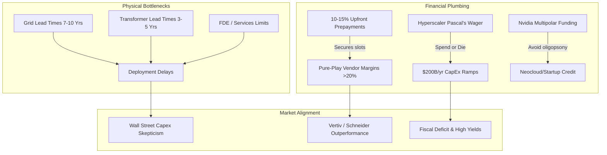

# SemiAnalysis Research: June 2026 Themes & Market Investment Synthesis

This document provides a comprehensive synthesis of the key research, reports, and industry commentary published by **SemiAnalysis** (and its founder, **Dylan Patel**) in June 2026. It maps out the main technology infrastructure themes, outlines the associated investment implications, and details how they align with the broader macroeconomic and asset allocation landscape.

---

## Executive Summary: Capital vs. Physical Constraints

In June 2026, the primary debate in the artificial intelligence sector shifted from theoretical model scaling to the **physical and logistic bottlenecks of hardware deployment**. While financial markets feared a rapid cancellation of capital expenditures (CapEx), SemiAnalysis proved that datacenter and supply pipelines are highly secure, but severely delayed by grid and manufacturing capacity constraints.

---

## 1. Core SemiAnalysis Themes (June 2026)

### Theme A: Rebutting the "50% Cancelled" Datacenter Narrative
A widely circulated Bloomberg/Sightline Climate report in June 2026 claimed that half of the projected 2026 US datacenter capacity (7 GW of 12 GW) was cancelled or delayed due to supply chain vulnerabilities. SemiAnalysis refuted this claim in its landmark report, ***"Stop Saying Half of 2026 US Datacenter Capacity Is Canceled"*** ^[investing-macro/market-newsletter-digest-2026-06-18.md]:
* **Construction Reality:** The self-builds of the top two hyperscalers alone exceeded 5 GW under construction, excluding third-party colocation pipelines.
* **Delayed, Not Cancelled:** Datacenter capacity is experiencing severe **delivery timeline slippages**, not structural demand cancellations. Slippages are driven by:
  * **Grid Connection Backlogs:** Metropolitan grid lead times have stretched to **7–10 years**.
  * **Long-Lead Components:** Substation transformer parts (such as Reinhausen tap-changer bushings) carry lead times of **3–5 years**.
  * **Manufacturing Capacity:** Electrical hardware suppliers (GE Vernova, Hitachi, Mitsubishi) are fully booked out 3–4 years. 
* **Backlog Protection & Margins:** Lenders and vendors are insulated. Hyperscalers are securing production slots with **10–15% upfront cash prepayments**, boosting pure-play vendor margins (Vertiv, Schneider Electric) above **20%** ^[investing-macro/market-newsletter-digest-2026-06-19.md].

### Theme B: Hardware-Software Co-Design & The Real AI Bottleneck
In an interview with Sequoia Capital's *Training Data* podcast, Dylan Patel detailed where AI efficiency gains originate and where future bottlenecks lie:
* **The "100x" Myth:** The industry's massive gains in compute efficiency are not derived from raw silicon shrinks (Moore's law density doubling has stalled). Instead, they come from **extreme co-design**—optimizing silicon architectures, low-precision kernels (FP8/FP4), HBM memory bandwidth, and compilation software simultaneously.
* **The Fab Bottleneck:** While the 2024–2025 bottleneck was datacenter space and power, the 2026+ bottleneck is returning to **leading-edge semiconductor fabrication** (ASML EUV throughput and advanced packaging slots at TSMC).
* **Compute vs. TAM:** Although 20 gigawatts of datacenter power is coming online in 2026, model utility (agentic capabilities) is expanding the total addressable market (TAM) faster than hardware supply can match, maintaining a structural compute deficit.

### Theme C: Nvidia's Multipolar Strategy & Vertical Integration
SemiAnalysis analyzed the competitive friction between Nvidia and its customers (the hyperscalers):
* **Avoiding Oligopsony:** Hyperscalers are vertically integrating by building in-house chips (Google's TPUv5e, Amazon's Trainium2/3) to bypass Nvidia's high gross margins.
* **Nvidia's Counter-Play:** Nvidia's Jensen Huang is actively funding a **multipolar AI ecosystem**. By directly investing in, guaranteeing loans for, and backstopping neoclouds (CoreWeave, SharonAI, Firmus) and model startups (OpenAI, Anthropic), Nvidia ensures a diverse customer base, preventing a few mega-hyperscalers from holding a buying monopoly.

---

## 2. Market Investment Implications

| Target Sector | Bull / Opportunity Case | Bear / Risk Case |
| :--- | :--- | :--- |
| **Grid & Electrical Hardware (Vertiv, Schneider Electric, Eaton)** | Structural backlog growth; high pricing power supported by **10–15% hyperscaler prepayments** ^[investing-macro/market-newsletter-digest-2026-06-19.md]. | Short-term delivery volatility due to component parts supply delays (e.g., transformer bushings). |
| **Hyperscalers (Amazon, Google, Microsoft)** | "Pascal's Wager" spend secures strategic leadership; vertical ASIC design (TPU, Trainium) lowers internal token margins. | Massive CapEx burn (**$200B/yr for Amazon, $180B/yr for Google**) pressures FCF margins, risking market re-rating if monetization slows. |
| **Leading Edge Memory (SK Hynix, Micron)** | High HBM pricing power; HBM commands a **5x pricing premium** over standard DRAM ^[investing-macro/market-newsletter-digest-2026-07-08.md]. | Extreme exposure to HBM-specific capital cycle downturns. |
| **AI Data Warehouses (Snowflake, Databricks)** | Building native semantic layers (e.g., Genie Ontology) directly on open data formats, bypassing proprietary operating systems. | Risk of commoditization if frontier labs integrate data layers natively into agent SDKs. |

---

## 3. Macroeconomic and Market Alignments

The June 2026 SemiAnalysis themes interact directly with broader macro indicators:

### 1. Hyperscaler CapEx vs. Wall Street Skepticism
Dylan Patel’s analysis of the hyperscaler spending wars outlines the "innovator's dilemma at planetary scale." Despite Wall Street’s skepticism over the cash-burn rates, hyperscalers must spend or face obsolescence. This supports the **Large Deficit Model** where government fiscal deficits and corporate debt coordinate to fund the buildout, keeping the macro credit cycle expansionary.

### 2. Physical Supply Chain Geopolitics
SemiAnalysis's coverage of grid and transformer delays aligns with the reality that **the US AI buildout is physically dependent on Chinese manufacturing** ^[investing-macro/market-newsletter-digest-2026-07-09.md]. Finished transformer imports from China grew to **8,000 units in 2025** ($3.48B) due to allied capacity constraints. Furthermore, vertical integration plays (like CATL investing $740M in DeepSeek's $7.4B round) show Chinese players using scale to capture downstream AI software leverage.

### 3. Yield Curve & Volatility regimes
The long lead times (3–5 years for electrical components) and massive multi-year cash commitments mean AI infrastructure acts as a **structural anchor on the long end of the yield curve**. High capital demand keeps Treasury yields elevated (10Y yield near 4.49%) even as headline energy inputs decline. This matches the hawkish Fed policy under Kevin Warsh, which focuses on sticky core services and structural supply pressure.

---

## Related Notes & Cross-References
* Structural Treasury supply and funding risk is analyzed in [[bond-supply-tsunami-2026]].
* High-voltage grid constraints and Chinese transformer dependencies are detailed in [[market-newsletter-digest-2026-07-09]].
* Historical valuation multiples and CAPE ratio metrics are logged in [[valuations]].
* Detailed daily developments can be tracked in [[market-newsletter-digest-2026-06-18]] and [[market-newsletter-digest-2026-06-19]].
