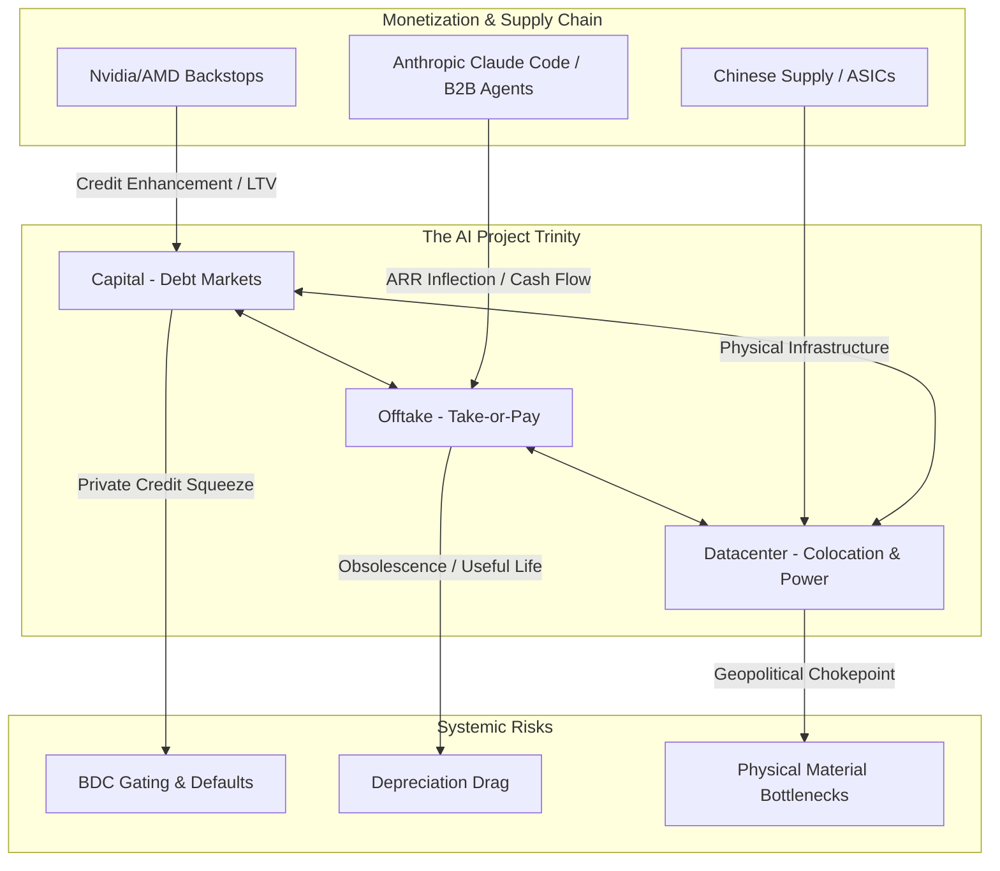

# SemiAnalysis Research: July 2026 Themes & Market Investment Synthesis

This document provides a comprehensive synthesis of the key research and blog posts published or highlighted by **SemiAnalysis** in July 2026. It maps out their core themes, details the associated investment implications, and aligns these trends with broader macroeconomic and market dynamics.

---

## Executive Summary: The Structural Inflection

The AI investment cycle in mid-2026 has crossed a critical threshold, shifting from a speculative speculative phase to a **disciplined, capital-intensive infrastructure and verticalized software model**. 

---

## 1. Core SemiAnalysis Themes (July 2026)

### Theme A: Nvidia's GPU Debt Backstop & "The AI Project Trinity"
As hyperscalers' balance sheets face capacity limits for raw CapEx, the funding structure of AI infrastructure is transitioning rapidly to **project-level debt financing** ^[investing-macro/market-newsletter-digest-2026-07-06.md]. SemiAnalysis defines this via **The AI Project Trinity**, where a project only succeeds by aligning:
1. **Capital:** Project financiers/lenders.
2. **Offtake:** Long-term (typically 5-year) take-or-pay compute contracts (see [[market-newsletter-digest-2026-07-06#Take-or-Pay Compute Contracts: Structure, Benefits, & Risks]]).
3. **Datacenter:** Secured high-MW colocation space with power.

#### Nvidia as the "Central Bank of AI"
Lenders require creditworthy, investment-grade backstops to underwrite 5-year debt. Startups and model labs cannot or will not commit to these tenors. Consequently, Nvidia has stepped in to act as a **credit enhancer**:
* **The Backstop Structure:** Nvidia provides a **6-year take-or-pay minimum revenue guarantee** to Neoclouds (e.g., on GB300 clusters) at a floor rate of **$2.33 to $2.36/hr/GPU**. In return, Nvidia takes a **40% revenue share** on pricing achieved above the floor.
* **Debt Underwriting:** While the floor yields near-zero project IRRs, it guarantees debt service. Lenders underwrite this minimum cash flow targeting a **1.3x Debt Service Coverage Ratio (DSCR)**, unlocking **70-80% Loan-to-Value (LTV)** project debt.
* **Pioneering Projects:** Projects like SharonAI (40,000 GB300s under a $4.88B Nvidia backstop) and Firmus (360MW Batam cluster backed by a $10B Blackstone/Coatue facility) demonstrate this model's scale. AMD has responded with similar capacity-rent-back guarantees to AWS, OCI, and Crusoe.

### Theme B: Anthropic's Monetization Milestones & IPO Financials
A major inflection point in frontier AI business models has occurred. Commercial monetization of foundation models is proving highly lucrative when tied to verticalized productivity tools rather than raw API token sales ^[investing-macro/market-newsletter-digest-2026-07-08.md]:
* **The Anthropic IPO:** Anthropic confidentially filed for an IPO on June 1, 2026. This contrasts with OpenAI, which has reportedly delayed its IPO to 2027 due to higher R&D cash burn.
* **Profit Milestones:** Propelled by the massive, viral adoption of **Claude Code**, Anthropic is projected to generate **over $1 billion in profit in Q3 2026**.
* **Valuation Potential:** The combined ARR of OpenAI and Anthropic has scaled to **~$100 billion**. Analysts project Anthropic's superior margin profile, pricing power, and enterprise software execution could eventually command a **$6 trillion market cap**.

### Theme C: Claude Code & The Demolition of Seat-Based SaaS
The release and rapid growth of **Claude Code** (representing 4% of all public GitHub commits in mid-2026, on track for 20%+ by year-end) has redefined how software is written ^[investing-macro/market-newsletter-digest-2026-07-08.md]. This "vibe coding" shift has deep structural implications for the enterprise software landscape:
* **Shifting Locus of Competition:** The core value has shifted from raw model benchmarks to the **Orchestration Layer ("Harness")**—the wrapper managing tools, memory, sub-agents, and verification loops. 
* **The Seat-Based SaaS Threat:** SaaS has historically monetized by selling human-user seats to manage data workflows. If AI agents can write directly to databases (e.g., querying Postgres, formatting charts, and emailing stakeholders autonomously via Model Context Protocol), the need for intermediate UI/workflow seats (CRM, BI, ITSM) collapses. Stated moats like data silos and workflow lock-in are eroding.
* **Microsoft's Conundrum:** Microsoft is caught in a structural bind. It sells GPUs on Azure to AI labs (generating massive infrastructure revenue), but those very labs (like Anthropic with Claude Code/Cowork) are releasing products that directly cannibalize Microsoft's highly profitable Office 365 and GitHub Copilot seat-based suites. 

---

## 2. Market Investment Implications

| Asset Class / Sector | Bull / Opportunity Case | Bear / Risk Case |
| :--- | :--- | :--- |
| **Mega-Cap Software (e.g., Microsoft, Salesforce)** | High initial distribution and API cloud revenues (Azure, AWS). | Collapse of seat-based Office 365 and CRM seat counts; high CapEx required just to maintain product parity. |
| **AI Hardware & Foundries (TSMC, SK Hynix)** | TSMC's Q2 gross margin hitting **68.4%** with pricing power; HBM memory selling at **5x DRAM price** premium (SK Hynix Nasdaq ADR listing). | SK Hynix's extreme revenue concentration (HBM is 8% of bits but 40% of revenue) exposes it to severe downside if GPU CapEx slows. |
| **Custom Silicon (ASICs)** | DeepSeek and Zhipu building internal ASIC teams for **low-cost inference**, creating cheaper alternatives to general-purpose GPUs. | High design and manufacturing execution risk; dependency on TSMC advanced node capacity. |
| **Enterprise SaaS Upstarts** | Verticalized AI agents (like [[app\|AppLovin's]] ad-engine or Samsara's physical ops labels) driving massive cash generation. | Legacy SaaS lacking proprietary data flywheels face severe multiple compression. |

---

## 3. Alignment with Broader Macro & Market Dynamics

The themes highlighted by SemiAnalysis do not exist in a vacuum; they interact directly with late-cycle macroeconomic signals:

### 1. The Capex Boom & Depreciation Arbitrage
While SemiAnalysis focuses on the tech stack, public equity markets are grappling with **earnings quality distortions** ^[investing-macro/market-newsletter-digest-2026-07-09.md]:
* **Burry's Warnings:** Michael Burry highlights that tech firms are playing a "depreciation arbitrage" game. Amazon shortened useful server lives to 5 years (increasing depreciation charges), while Meta extended server lives to 5.5 years (boosting reported net income by **$2.9 billion**). 
* **Obsolescence Risk:** If GPU useful lifespans are actually 2-3 years due to rapid release cadences (Hopper to Blackwell to Rubin), massive accumulated depreciation charges will soon hit P&Ls, severely depressing hyperscaler earnings. See [[valuations]].

### 2. The Private Credit and BDC Squeeze
The multi-trillion-dollar AI infrastructure buildout is heavily funded by the private credit market rather than public banks. This has created a critical vulnerability:
* **BDC Redemption Gates:** Retail Business Development Companies (BDCs) are experiencing a severe liquidity mismatch ^[investing-macro/market-newsletter-digest-2026-07-07.md]. Apollo Debt Solutions, Blackstone BCRED, and Ares have been forced to cap quarterly redemptions at **5% contractual ceilings** as withdrawal requests surge.
* **Default Inflections:** Trailing direct lending defaults have ticked up to **2.3%** (on track for 3.5% by year-end), while Fitch's private credit default measure (which captures PIK conversions and maturity extensions) stands at **6.0%**. Lenders are heavily exposed if neoclouds or AI startups default on their take-or-pay agreements (see [[credit-spread-investing-guide-20251019-notes]]).

### 3. Geopolitical Supply Chain Chokepoints
The hardware required to fulfill the "Project Trinity" datacenters remains heavily dependent on China, creating a mismatch between US software leadership and physical execution ^[investing-macro/market-newsletter-digest-2026-07-09.md]:
* **Grid Components:** US datacenter construction has forced a surge in Chinese high-power transformer imports (growing from 1,500 units in 2022 to **8,000 units in 2025**, worth $3.48B) due to domestic supply shortages.
* **Energy Storage & Materials:** Large-scale BESS storage (Tesla Megapacks) remains reliant on Chinese LFP cell manufacturing. In addition, China's proposed export controls on rare metals (MOFCOM Announcements 55-58, 61-62) target critical materials like **indium phosphide** used in optical transceivers.

### 4. Active vs. Passive Market Dynamics
Stretched valuations (CAPE ratio corrected for the earnings bubble stands at **67.6x**) and high index concentration have forced active managers to alter their investment strategies ^[investing-macro/market-newsletter-digest-2026-07-07.md]:
* **Terry Smith's Rule Break:** Fundsmith's Terry Smith broke his legendary "do nothing" buy-and-hold rule to execute the largest portfolio overhaul in his fund's history—selling stable consumer giants (LVMH, Nike) to buy high-beta tech momentum plays (TSMC, AppLovin, Uber), highlighting the extreme pressure active managers face from passive index flows (see [[active-vs-passive]]).

---

## Related Notes & Cross-References
* Structural Treasury supply and funding risk is analyzed in [[bond-supply-tsunami-2026]].
* Expected return frameworks and baseline intrinsic value metrics are logged in [[valuations]].
* Detailed daily developments can be tracked in [[market-newsletter-digest-2026-07-06]], [[market-newsletter-digest-2026-07-08]], and [[market-newsletter-digest-2026-07-09]].
