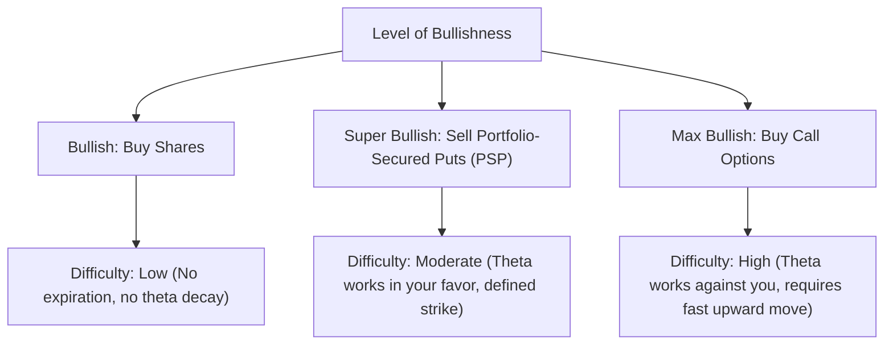

# Portfolio-Secured Puts (PSP) Strategy Guide

**A Comprehensive Guide to Portfolio-Secured Puts, Capital Efficiency, and Long-Term Value Investing**

This guide synthesizes the options and portfolio management methodology discussed by Brandon Arnett (*Investing with Brandon*) in his interview. It outlines the core principles of using existing equity holdings as put collateral to eliminate cash drag, maps out the "Bullish Hierarchy," and lists concrete risk parameters and stock selection frameworks.

---

## Table of Contents

1. [Quick Start Summary](#quick-start-summary)
2. [The "Big Four" & Asset Allocation Framework](#the-big-four--asset-allocation-framework)
3. [The Bullish Hierarchy](#the-bullish-hierarchy)
4. [Portfolio-Secured Puts (PSP) vs. Cash-Secured Puts (CSP)](#portfolio-secured-puts-psp-vs-cash-secured-puts-csp)
5. [Actionable Rules for PSP Execution](#actionable-rules-for-psp-execution)
6. [The Case Against Covered Calls](#the-case-against-covered-calls)
7. [Stock Selection & Valuation Framework](#stock-selection--valuation-framework)

---

## Quick Start Summary

* **The Core Strategy:** Instead of securing short put options with idle cash (yielding low returns and creating cash drag), use the equity value of a long-term, index-heavy portfolio as margin collateral.
* **Option Parameters:** Sell long-duration puts (1 to 2 years to expiration) on high-conviction, undervalued, cash-flowing companies with clear EPS growth, setting strike prices 10–15% below current market price.
* **Compounding Mechanism:** Collect large upfront credits and immediately reinvest those dollars back into long-term shares of the target stock or major index ETFs, generating a self-compounding loop.
* **Risk Limit:** Maintain a **Sold Put Assignment Value (SPAV)** ratio of $\le 45\%$ of your total portfolio value. This ensures that even in a catastrophic 50% market correction, your liquidated portfolio value can cover 100% of your assignment obligations, eliminating margin call and liquidation risk.

---

## The "Big Four" & Asset Allocation Framework

Before entering any option trade, assess the macroeconomic environment and establish a solid long-term equity baseline.

### 1. The "Big Four" Macro Checklist
Evaluate these metrics to determine overall market conviction (Bullish, Neutral, or Bearish):
1. **S&P 500 & NASDAQ Valuations:** Are major indexes overvalued, fair-valued, or undervalued?
2. **Interest Rates:** Rates act as gravity on stock multiples. Are they rising, stable, or falling?
3. **Earnings Per Share (EPS) Growth:** What is the forward trajectory of index earnings?
4. **Economic Health:** What are the indicators for unemployment, capex cycles, and systemic growth?

### 2. Base Portfolio Allocation (The 40/40/20 Split)
Under neutral or average macro conditions, establish the following structural allocation to ensure your portfolio matches market performance and cannot be easily beaten:
* **40% S&P 500 Index (SPY/VOO):** Steady, diversified large-cap core.
* **40% NASDAQ Index (QQQ):** High-growth, technology-tilted exposure.
* **20% Individual Stocks:** Hand-selected individual companies trading at clear discounts to intrinsic value.

> [!TIP]
> This index-heavy core acts as "schmuck insurance." Since the largest companies in the indexes rotate over decades, owning the basket ensures you automatically capture the winners of structural shifts (like AI) without needing to guess which company will dominate in 10 or 20 years.

---

## The Bullish Hierarchy

Option strategies are not standalone income engines; they are magnifiers of an underlying directional thesis. Brandon aligns option selection to his level of bullishness:

* **Buy Shares (Bullish):** The safest long-term path. No expiration date, no time decay (theta), and you participate 100% in any rally.
* **Sell Puts (Super Bullish):** Done only when the underlying stock is fundamentally undervalued. It offers a discount entry point while generating upfront cash.
* **Buy Calls (Max Bullish):** Extremely difficult to make money consistently. You must get the direction, timing, and velocity right to prevent theta from destroying the position.

---

## Portfolio-Secured Puts (PSP) vs. Cash-Secured Puts (CSP)

Traditional options education advocates for the "Cash-Secured Put" (CSP), which Brandon argues is structurally inefficient for long-term investors.

### Structural Comparison

| Metric / Feature | Cash-Secured Put (CSP) | Portfolio-Secured Put (PSP) |
| :--- | :--- | :--- |
| **Collateral** | Idle cash locked in a sweep account or short-term T-bills (e.g. SGOV). | Existing equity holdings (S&P 500, NASDAQ, individual stocks). |
| **Capital Efficiency** | **Low.** Cash drag limits your participation in market rallies. | **High.** Your capital remains 100% invested in equities while securing puts. |
| **Premium Reinvesting** | Small premium (short duration) is usually left in cash. | Large premium (long duration) is immediately reinvested in equities. |
| **Margin Interest** | None. | **None.** (No interest is charged because your cash balance remains positive). |

### The Opportunity Cost of CSPs
Selling CSPs to acquire a stock you want is often counter-productive:
1. **The Assignment Paradox:** If you are correct in being bullish, the stock will rise. You will never get assigned, keeping only a small cash premium (peanuts) while missing a massive equity rally.
2. **Cash Drag:** If the market rises 20%, your collateralized cash only makes a small yield (e.g., 4% in SGOV), leaving you significantly behind the S&P 500's total return.

---

## Actionable Rules for PSP Execution

To safely execute the Portfolio-Secured Put strategy without risking account liquidation, adhere to the following rules:

### 1. Duration: Go Out 1 to 2 Years
* **Bypass short-term noise:** Do not sell weekly or monthly contracts. Sell **12- to 24-month puts**.
* **Linewidth / Premium Capture:** Selling a two-year contract allows you to collect a massive upfront credit (e.g., $18,000) rather than a monthly series of small credits (e.g., $1,000). 
* **Wider Margin of Safety:** Long duration allows you to set your strike price **10% to 15% below** the current market price while still receiving significant premium.
* **Earnings Growth Buffer:** A two-year window allows the company's Earnings Per Share (EPS) to grow. Since stock prices follow EPS in the long term, this growth structurally pulls the stock away from your strike price.

### 2. Manage the Sold Put Assignment Value (SPAV)
Your primary risk control metric is the SPAV:
$$\text{SPAV} = \frac{\text{Total Capital Required for Assignment on All Short Puts}}{\text{Total Portfolio Value}}$$

* **Rule of 45%:** Keep your SPAV at or below **45%** under normal market conditions.
* **Voluntary Drawdown Protection:** If a $1,000,000 portfolio suffers a catastrophic 50% drop, its value falls to $500,000. Because your SPAV is capped at 45% ($450,000 of assignment obligation), you can easily liquidate your base portfolio to cover 100% of the assigned shares. This completely eliminates margin call risk.
* **Scale with Market Cheapness:**
  * When the market is overvalued/extended (e.g. running to "Pluto"), lower your SPAV to be conservative.
  * When the market dips significantly (e.g. the 2026 Iran geopolitical dip), increase your SPAV to capture high implied volatility (IV) and lock in peak premiums.

### 3. Reinvest the Cash Flow Immediately
* When you sell a 2-year put, you receive a massive credit immediately.
* **Do not keep it in cash.** Reinvest that cash flow directly into shares of the underlying stock (at the current price) or into SPY/QQQ.
* **The Compounding Effect:** If you sell a put for $10,000 and the stock rises, that $10,000 of shares may appreciate to $11,000. Even if you choose to buy back the put for $1,000, you are left with $10,000 worth of "free" shares that compound in perpetuity.

### 4. Rolling Strategy
* If a trade goes against you, roll the options **down and out** (e.g., roll a 2027 put to a 2028 put at a lower strike).
* This lowers your SPAV, secures a cheaper entry price, books a tax loss for the current year (useful for offsetting gains), and buys time for the company's EPS to grow and recover.

---

## The Case Against Covered Calls

Brandon strongly advises against selling covered calls on high-quality companies:
* **Conflicted Position:** Selling a covered call means you are bullish (owning the stock) and bearish/neutral (betting it won't exceed the strike) at the same time.
* **Capping Your Upside:** You cap your maximum gain on your best-performing holdings. If a stock (like the Reddit case study) gaps up 25% in a day, your shares are called away, leaving a massive amount of profit on the table.
* **Underperforming the S&P 500:** Over long periods, the "wheel" strategy (alternating cash-secured puts and covered calls) underperforms simple buy-and-hold investing due to taxes, trading fees, and capped upside.

---

## Stock Selection & Valuation Framework

PSP execution must be restricted to high-quality, undervalued, durable enterprises. Speculative or high-multiple momentum stocks should never be used.

### 1. The "I Don't Know" Rule
* If you cannot build 100% conviction in a company's competitive moat, regulatory landscape, or future pricing power, the answer is a hard **"No."**
* **Workday (WDAY) & SAP (SAP) Moat Example:** They own critical HR and corporate compliance database integrations. CFOs and audit committees will not replace their systems with unproven, "vibe-coded" AI software because payroll errors trigger massive class-action lawsuits. This moat is highly durable.
* **Adobe (ADBE) Moat Example:** While historically strong, Adobe faces severe existential AI disruption. Because the durability of its moat is highly uncertain, it violates the "I Don't Know" rule and must be avoided, even if it looks statistically cheap.
* **Salesforce (CRM) Example:** Highly debated; though historically consistent in expanding revenue and free cash flow margins, the threat of AI disruption makes its moat less certain.

### 2. P/E vs. Growth Arbitrage (Nvidia vs. AMD Case Study)
When choosing between competitors, compare what you pay versus what you get:

* **Nvidia (NVDA):** Trailing P/E of ~35. High revenue growth, superior operating margins, and clear product dominance. You pay $35 to get $1 of earnings.
* **AMD (AMD):** Trailing P/E of ~120. Much lower top- and bottom-line growth compared to Nvidia, with weaker margins. You pay $120 to get $1 of earnings.
* **Conclusion:** Nvidia represents the "house" (odds stacked in its favor), whereas AMD represents the "player" (hoping for multiple expansion). Avoid high P/E multiples that are unsupported by corresponding cash flow and margin dominance.

### 3. Valuation Cross-Checks
Use multiple independent models to establish a margin of safety:
* **WACC & Terminal Growth:** Strictly evaluate the weighted average cost of capital and terminal growth rates in your discounted cash flow (DCF) models.
* **Benjamin Graham Revised Intrinsic Value Formula:** Use it as a secondary baseline for growth-rate-supported value estimation.
* **Conviction Rule:** Only allocate capital when multiple valuation cross-checks (e.g., DCF, Graham formula, P/E ratios) confirm a **40%+ discount** to fair value.

---

## Related Notes & Cross-References
* Full transcript of the interview is located in [[portfolio-secured-puts-interview-20260715-transcript]].
* Details on macroeconomic indicators and cash drag comparisons are available in [[valuations]].
* Guidelines on options risk management are located in [[trading-approaches]] and [[options-concepts]].
