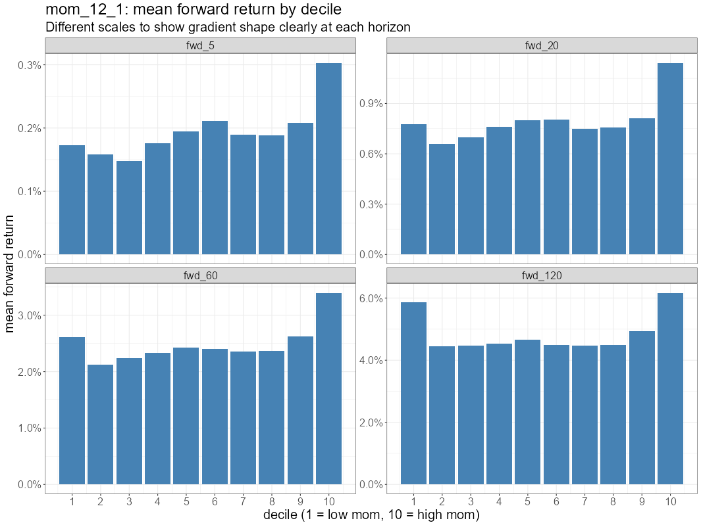
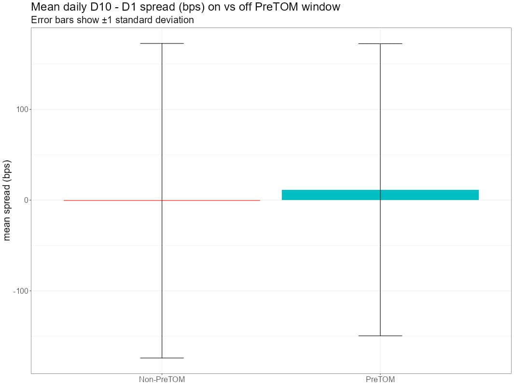
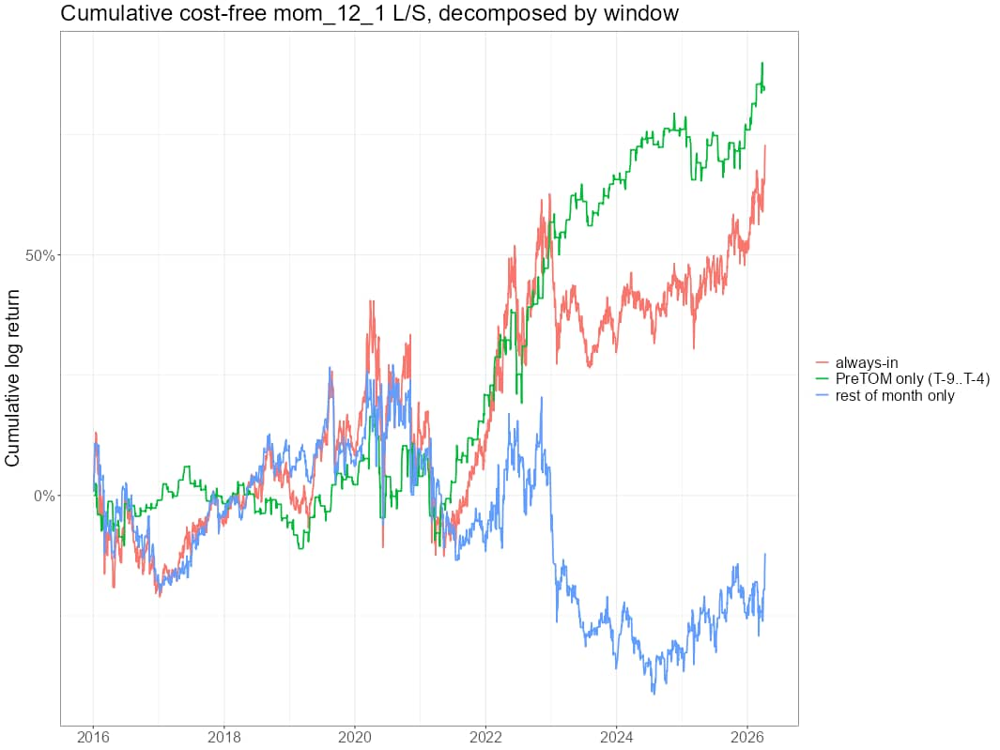
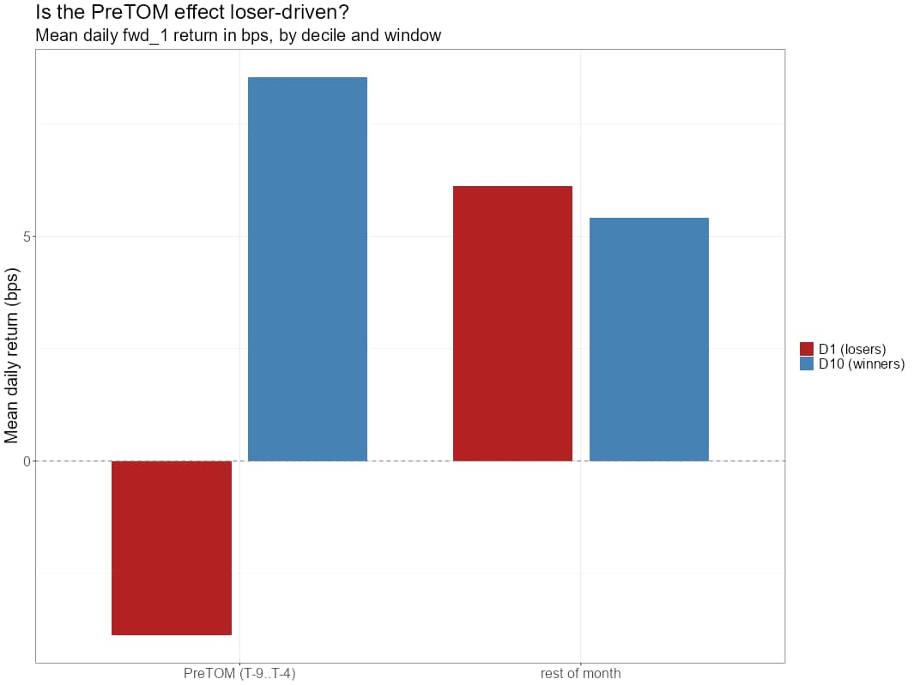
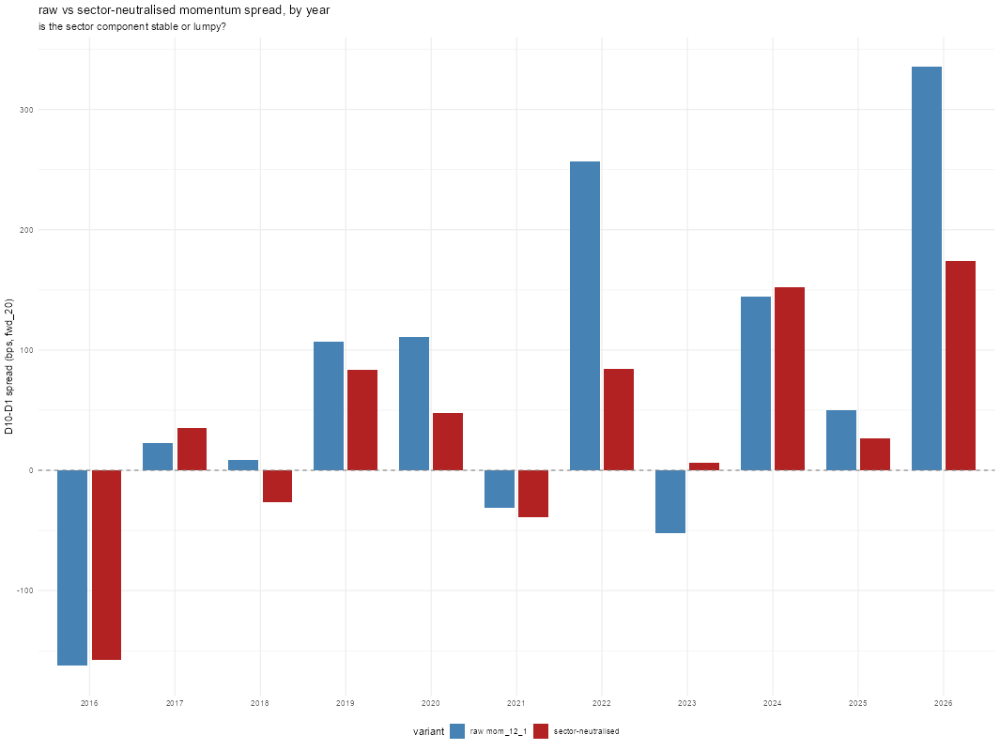

# RW Pro Newsletter: Combining Factors and Does Momentum Only Work Six Days a Month?

*By Kris Longmore | April 18, 2026*

We covered a lot of ground in this week’s [webinar](https://robotwealth.com/rw-pro-webinar-20260416-combining-factors-and-momentum/). Two big topics: a conceptual framework for how we’re going to combine factors into the stat arb portfolio, and a proper look at momentum as our first factor research effort in the Lab.

The combining factors piece is a work in progress. I’m not pulling a finished product off a shelf, because there isn’t one to pull. The existing literature on factor combination is split between academic stuff that falls apart in practice and institutional stuff that assumes a scale we don’t have. What I’m putting together is built for people like us, and I’m building it live with you. Some of it will evolve as we stress-test it.

On the momentum side, member @halves shared a paper in Discord, “The Intra Month Momentum Cycle” by Nathan, Suominen and Tasa, which argues that the entire momentum premium is concentrated in about six trading days per month. When I read it I thought: if this is true, it’s a pretty clear path to money. That tipped me into doing the momentum research now rather than later. So we ran a full analysis on our liquid universe, starting with the canonical 12-1 momentum factor and then specifically testing the paper’s claims.

The results are pretty wild.

## Key Points for Your Trading

*   **Canonical 12-1 momentum works in our universe.** The decile gradient goes in the right direction, with a D10-D1 spread of about +57 bps at the 20-day forward horizon. That’s in the ballpark of what the literature says the factor is worth. Reasonably consistent year to year (2016 and 2022 being the main exceptions). Low daily turnover (~82% of stocks stay in the same decile day to day), which is what you’d expect from a 252-day lookback.
*   **But the realised Sharpe is underwhelming.** The D10-D1 long-short Sharpe is only about 0.26, which is low given the cross-sectional spread. That gap between “the decile chart says there’s an edge” and “the equity curve looks average” is a clue that the premium might not be evenly distributed across the calendar.
*   **The momentum premium does look concentrated in a specific window each month**, roughly trading days T-8 to T-4 counting back from month-end. On those days, the D10-D1 spread averages +11.5 bps per day. Outside that window, it’s slightly negative on average. But I want to be clear: the day-level data is noisy, the “strong days” move around year to year, and the exact boundaries are a rough approximation rather than a clean on/off switch. If this broad pattern holds up, it has implications for how you’d trade a momentum sleeve, but any implementation that depends on the boundaries being precise is probably over-fitting.
*   **Further, the T-9 to T-4 window specified in the paper has the whiff of cherry picking.** I don’t have a lot of confidence in the reasons given for the effect to not persist through month end (institutions avoiding a month-end rush). I feel that a more honest expression of the effect would be “momentum returns are slightly higher on average in the second half of the month”, potentially justifying a tilt in that direction rather than a hard cutoff. Even that expression of the effect is noisy and not as consistent as I’d like.
*   **The intra-month effect is driven more by losers getting sold than winners getting bought.** D1 (the biggest losers) actually has a negative average return during the concentration window, while returning positive the rest of the month. D10 (winners) gets a small bump during the window but is broadly similar either way. This is consistent with the “dash for cash” hypothesis from the paper, though I’d stop short of calling it proof. The pattern fits that story, but other stories could fit too, and the mechanism hasn’t been validated with actual fund managers.
*   **Momentum survives in liquid stocks.** Counter to what you’d normally expect, the effect actually showed up *stronger* in the most liquid tercile of our universe. That’s consistent with the paper’s hypothesis about institutions preferentially selling liquid losers, though again, consistent with a story doesn’t mean the story is correct.
*   **A big chunk of momentum is sector rotation**, and it’s regime-dependent. Sector-neutralised momentum is about half the raw spread over the full sample, but that halving is driven by a few high-dispersion years (2020, 2022, 2026). In normal years, within-sector stock selection does most of the work. We probably want to sector-neutralise as the default for the sleeve, and maybe tilt depending on whether dispersion turns out to be sticky (more analysis needed).
*   **We introduced a sleeve-based framework for combining factors**, purpose-built for solo operators. Each factor gets its own sleeve (own signal, own cadence, own risk budget). We combine at the ticker level and apply the universe constraint last.
*   **New data sets in the Lab.** Two new functions in rwRtools: `equity_get_liquid_universe()` gives you price data for every ticker that’s ever passed our liquidity filters (about 4,000 stocks, ~2,200 in the index at any given time, back to 2015), with a point-in-time `IS_INDEX` flag so you can compute features on the full history and then filter to the tradeable universe without look-ahead. `equity_get_liquid_universe_sectors()` adds sector and industry data. Both update in close to real time. The momentum notebook shows how to use them.

## A Quick Note on “Factors”

Before we go further, Euan made a good point in the session that’s worth repeating. When the academic literature talks about “factors,” it means longer-term cross-sectional equity selection stuff: value, size, quality, that kind of thing. Fama-French, going back to the early eighties.

We’re using the word more loosely. For us, a factor is any cross-sectional effect we can measure and potentially trade. Some of ours overlap with the academic factors (momentum, for example). Others, like our triangulated pair z-scores, don’t map to anything in a textbook. So when I say “factor” in the context of the stat arb work, I’m talking about a cross-sectional edge at whatever timescale makes sense.

## The Combining Factors Framework

I’ve been saying for a while that the biggest improvement we can make to the stat arb strategy is adding more factors. Right now we’re running one main signal (the triangulated pair signal), and portfolio theory is very clear on this: combining uncorrelated edges beats any single great edge, and the marginal benefit of adding the second and third factor is enormous.

But saying “add more factors” and doing it are two different things. How do you weight them? What cadence do you run each at? What happens when two factors disagree? What do you do when you’ve got capacity for a hundred positions but three factor sleeves want two hundred?

When you go looking for answers, they aren’t really out there. Not for us.

### What’s a sleeve?

A sleeve is to a factor what a strategy is to an edge. Think of it as a self-contained portfolio built around a single factor. It has its own signal, its own target positions, and its own rebalance schedule. Each factor gets its own sleeve. The momentum sleeve holds whatever the momentum signal says. The stat arb sleeve holds whatever the z-scores say. They each produce a target position vector, and then we add those vectors together and trade the net.

The term comes from institutional asset management where a big fund is divided into sleeves managed by different teams. For us it’s simpler, but the idea is the same: each sleeve is a building block that contributes to the final portfolio.

### Four guiding principles

These four principles inform the whole approach. They show up all over our work, from individual strategy research through to portfolio construction, and they’re worth internalising because they’ll keep coming back as we build this thing out.

1.  **Mechanism outranks backtest Sharpe.** A clean mechanism (who’s on the other side, why the edge persists) is stronger evidence than a 1.2 Sharpe measured on five years of data. The default is equal weight across sleeves. You deviate when you have a good reason, and “this one backtested a little better” is not a good reason. “This one has a structural mechanism that isn’t going away” is.
2.  **Focus on what you can know and control.** You can estimate volatility in weeks. You can characterise a factor’s decay curve in a year or two. You can understand the mechanism because you derived it from thinking about who’s on the other side. What you can’t estimate with any precision: expected returns, covariances, the difference between a Sharpe 0.5 factor and a Sharpe 1.0 from a year of data. The textbook approaches lean on those last three, which is why they fall apart in production.
3.  **Respect each factor’s character.** Some factors decay in days, some in months. The default should be to let each factor trade at its natural cadence rather than forcing everything onto a common clock. Forcing a slow factor onto a daily rebalance eats it alive with noise-driven turnover. Over-smoothing a fast factor past its natural horizon kills the signal.
4.  **Use constraints heavily.** You can simply cap concentration at a certain level, or prevent a factor’s sign from flipping, or limit sector exposure. Every constraint removes a way the portfolio can hurt you, and it doesn’t necessarily cost alpha if the constraint was going to be violated by something you didn’t want in the first place. But we do need to be aware of potential trade offs.

### Three structural pillars

**Each sleeve runs itself.** Own signal, own cadence, own risk budget. A slow momentum sleeve rebalances weekly or fortnightly. A short-term reversal sleeve rebalances daily. We won’t force them onto a common clock.

**Separate your signal universe from your trading universe.** Compute signals on the broad universe (about 2,000 stocks), then pick the hundred or whatever you actually trade. Ranking a small universe amplifies noise. Ranking two thousand and taking the top slice gives you a much stronger cohort.

**Combine first, constrain last.** Stack the sleeve target positions at the ticker level, get a net target vector, then apply the hundred-slot selection filter. If you filter each sleeve separately and try to add them up, you waste capacity on positions that would have netted out.

And one thing I want to flag: **turnover control is part of the model.** With a hundred slots, the thing that drives turnover is names crossing the rank boundary, and most of those crossings are noise. A buffer rule (“stay in unless a name outside beats you by 20% of the signal spread”) will cut turnover drastically without hurting alpha too much, because the names at the boundary have basically the same expected return anyway.

This is a work in progress. We’ll stress-test all of it against real factors over the coming sessions.

## Momentum: Still Not Boring After Thirty Years

Now for the fun part. We ran a full Hat 1 analysis on cross-sectional momentum in our liquid universe. The notebook is in the Lab under `equity-factors-pod/research/mom-factor/` if you want to run it yourself.

### The setup

Canonical 12-1 cross-sectional momentum: twelve months of return, skipping the most recent month to avoid short-term reversal contamination. Daily cross-sectional decile sort on our liquid universe of about 2,200 stocks going back to 2015.

The research question: what does momentum look like in our universe, where does it break down, and does it show up differently within the month?

### The baseline result

The factor “works.” The decile gradient goes in the right direction, D10 (highest momentum) outperforms D1 (lowest) at the 20-day horizon by about +57 basis points. That’s in the ballpark of what the literature says momentum is worth in the US cross-section over the modern sample.

But the realised Sharpe of the D10-D1 long-short portfolio is only about 0.26 over the full sample. For a +57 bps average spread, you’d expect a higher Sharpe than that. So there’s a gap between “the cross-section says there’s an edge” and “the daily equity curve looks average.”

One explanation for that gap: the premium isn’t spread evenly across the calendar. Which brings us to the paper.

### The intra-month momentum cycle

As I mentioned up top, the Nathan, Suominen and Tasa paper (a copy is in the equity factors pod) argues that the momentum premium is concentrated in a specific 6-day window each month: trading days T-9 through T-4, counting backwards from month-end. They call this the PreTOM (pre-turn-of-month) window.

Their proposed mechanism: mutual funds and pensions have to raise cash around month-end for redemptions, T+2 settlement, and accounting. When they need to sell, they sell the losers first. Losers are the path of least resistance: unrealised losses (good for tax), lower dividend yields, fewer defenders inside the fund. And they do it in the week *leading up to* month-end because by T-3 everyone’s trying to avoid the rush.

I want to be straight with you about where I sit on this. The broad empirical pattern, that momentum returns are concentrated in the second half of the month, does replicate on our data. That part I’m fairly confident in. But the specific mechanism (dash for cash, settlement timing) and the precise window boundaries (why T-9 to T-4 specifically?) are working hypotheses rather than established facts. As Euan pointed out, the right way to validate that mechanism would be to talk to actual fund managers and ask them if that’s what they do, rather than inferring it from the data. The paper’s reasoning for why the selling happens at T-9 to T-4 (avoiding the end-of-month rush) feels like a reach to me. And the day-level data in our sample paints a messier picture than the paper suggests.

Here’s what we found.

I split each month into PreTOM days (T-9 to T-4) and everything else. The momentum L/S spread (D10 minus D1) averages **+11.5 basis points per day** in the PreTOM window. Outside that window, it’s **-0.65 bps per day**. Slightly negative.

That looks like a massive concentration. But when I decomposed it day by day, counting back from month-end, the picture gets muddier. T-9, which is supposed to be the start of the paper’s window, is actually one of the weakest days in our sample (negative in the pooled data). T-8 is the strongest. The positive cluster runs roughly T-8 to T-4, with T-6 being weaker. And the yearly facets show no stable day-level pattern; the “strong days” move around from year to year.

A more honest framing: the second half of the month is noisily more positive than the first half. At a stretch, the final third (roughly T-8 onward) is noisily more positive than the first two-thirds. But it’s not a sharp window. The paper’s T-9 to T-4 is one way to draw a box around a diffuse effect, and it’s not obviously the best box for our data. And the effect doesn’t really show up in the first few years of our sample.

Practical implication: any implementation that tries to be surgically in and out on exactly 6 days is over-fitting a noisy pattern. A more robust approach would be to tilt the momentum sleeve toward the second half of the month, accept that the timing is approximate, and not build a strategy that depends on the boundaries being precise.

When I decomposed by side, the effect is mainly loser-driven. D1 (losers) has a negative average return during the PreTOM window (-3.9 bps) while returning positive (+6.1 bps) the rest of the month. That’s a 10 bps per day swing. D10 (winners) shows a smaller bump during PreTOM (+8.5 bps vs +5.4 bps, so about +3 bps difference). The losers are doing most of the heavy lifting.

This is consistent with the “dash for cash” hypothesis, though I’d stop short of calling it proof. The pattern fits the story, but other stories could fit too. The paper emphasises that the effect is entirely loser-driven, and that’s not quite what we see: there’s a small winner-side effect too. Could be a difference in universe, a difference in sample, or both. It’s a small effect either way. Maybe it’s strengthened in recent years.

### What about the lookback?

I ran a sweep across different lookback windows and skip parameters. Short-term momentum (5 to 21 days) is actually a *reversal* effect. The sign flips somewhere between 21 and 63 days. Six-month momentum (126 days) showed a significantly higher spread than 12-month in our sample, which is worth investigating further, though I’d want more data before making too much of it.

The 1-month skip (skipping the most recent month of returns) adds about 5-6 bps per month to the spread. Without it, the top decile gets contaminated with stocks that just spiked (and are about to mean-revert), and the bottom decile with stocks that just crashed (and are about to bounce). The skip lets the reversal play out before the momentum signal takes over.

### Conditioning on other stuff

**Volatility:** Momentum makes money regardless of which volatility bucket a stock sits in. You see the expected monotonic increase (higher vol = bigger absolute spreads) until the extreme high-vol bucket, where something breaks down a little. Maybe liquidations and forced reversals in high-vol environments. Not enough to act on, but worth watching.

**Beta:** Similar story. The factor shows up across beta buckets. Momentum is not beta in disguise. There’s an interesting inverted-U shape (mid-beta stocks showing stronger momentum than the extremes) that I don’t have a clean explanation for yet. Parked for now.

**Sectors:** This is the most interesting conditioning result. When I neutralised momentum by sector (ranking stocks within each sector rather than across the whole market), the D10-D1 spread roughly halved over the full sample. That implies a big chunk of what we’re calling “momentum” is actually sector rotation: tech going up, energy going down, and momentum mechanically loading onto those bets.

But when you break it down by year, the story gets more interesting. In most years, the blue bars (raw momentum) and the red bars (sector-neutralised) are similar in magnitude. The big gaps are 2020, 2022, and 2026 (partial data). These are years where sector return dispersion was extreme. In 2020, long momentum was basically long tech, short energy (a sector bet). In 2022, the rate dynamics flipped that trade. In normal years, 70-80% of the momentum spread is within-sector stock selection. The full-sample “halving” is driven by a handful of years where the sector component exploded, not by a persistent base rate.

So it’s not that “half of momentum is always sector rotation.” It’s that in most years the within-sector signal is doing most of the work, and in a few extreme years sector rotation dominates so heavily it drags the pooled average to roughly 50/50.

The practical takeaway: the sector-neutralised version should be our base when building the momentum sleeve. It’s the stable part. The sector-rotation bonus shows up when sectors trend hard, but you can’t count on it being there. If we could predict when sector dispersion is high (and I suspect it might be a bit sticky, but we need to check), we could let some sector exposure through in those regimes. That’s a Hat 3 (architect) question we'll come back to.

### The factor exploration framework

I also put a framework for doing this kind of research in the Lab. It’s a scaffold, definitely not a recipe to follow blindly: start with mechanism, define the factor precisely, sanity-check it, look at the raw distribution, do your cross-sectional bucketing, check persistence and decay, facet by year, proxy turnover, check interactions with other known factors, and note open questions. Each factor deserves to be treated on its own merits. If you find something unexpected while working through it, pull on that thread. That’s usually where the interesting stuff gets discovered.

I’m keen for the Lab to become a place where the community can scale this research effort. That was actually one of the motivations for building it. If you’ve got a factor idea, grab the framework, grab the data, and have a crack at it. And let me know if you want to contribute research – I’ll need to give you write access to The Lab’s repositories (just DM me on Discord).

## Infrastructure Update

Quick infrastructure note from @hac. The Airflow migration is wrapping up and there’s now a **status page at status.robotwealth.com** where you can see what data sources are being pulled, whether there are any issues, and when the jobs kick off. Worth bookmarking.

Also, the statarb intraday pipeline now runs an additional task **30 minutes before the close**, on top of the existing runs at the open and top of every hour. And there’s a factorium service coming that we’ll talk about in the coming weeks (API endpoints for various factors).

## What’s Coming Next

Over the next few sessions, we’ll continue wearing the scientist and engineer hats. One factor per session, building up the standalone sleeve characterisation for each. Once we’ve got two or three sleeves in hand, we come back to the architect framework with something concrete and combine them for real.

If you haven’t already, pull up the momentum notebook in the Lab and have a play. Run it, poke at it, see if you agree with my conclusions. And think about the mechanism question, because where we land on that determines whether momentum earns a sleeve in the portfolio.

See you on Discord!

Kris
