# Momentum Factor Research: Notebook Walkthrough

This document provides a detailed, step-by-step walkthrough of the `momentum_factor_research.ipynb` notebook. It explains both **what** the code is doing technically and **why** the step is being taken from a quantitative research perspective.

---

## Preface: What This Is

This is "Hat 1" work — curiosity-driven factor research. The goal is not to immediately build a trading strategy. It's to understand whether momentum exists in this universe, why it might exist, and where it breaks down. Trading strategy design comes later, and attempting it too soon cuts off the ability to understand deeply.

The approach:
1. Start with mechanism — who is buying and selling, why, and why this would persist
2. Define the factor precisely before touching code
3. Sanity-check the computation, then explore the distribution
4. Use cross-sectional bucketing (decile sorts) as the primary analytical lens
5. Condition on known confounds (size, vol, beta, sector) to isolate the signal
6. Follow surprising findings wherever they lead

---

## 1. The Idea

Momentum is the thing that shouldn't work and does anyway. Buy what went up over the last year (skipping the most recent month), sell what went down, and you get paid. It's been written about for thirty years, traded to death by every quant shop on earth, and it still hasn't been arbitraged away. That alone is grounds to be curious about the mechanism.

**Candidate mechanisms:**

- **Delegated flows:** institutional money chases recent winners and dumps recent losers on a predictable cadence, because that's how mandates, benchmarks, and career risk work inside a fund.
- **Slow information diffusion:** when a stock starts doing well for a fundamental reason, the news spreads through the investor base over weeks and months rather than seconds.
- **Month-end dash for cash:** funds have to raise cash around month-end for redemptions and settlement. When they sell, they sell the losers first. A recent paper (Nathan, Suominen and Tasa, 2026 — *The Intra Month Momentum Cycle*) argues this concentrates the premium into specific days each month. The empirical pattern looks real in this data, but the precise mechanism and T-9 to T-4 window are hypotheses to test, not conclusions to build on.
- **Fundamentals persistence:** companies doing well are doing well for a reason. Good management, growing markets. Those things don't stop at the 12-month mark. Novy-Marx (2015) shows a large fraction of momentum returns can be explained by serial correlation in fundamental performance.

The likely reality: "momentum" is a composite of all of these effects, and their relative weight has probably shifted over time as markets got more efficient. What's left increasingly looks like structural flow (month-end plumbing, mandates, redemption cycles) rather than slow information diffusion.

**The canonical factor formula:**

```
mom_12_1 = closeadj[t-21] / closeadj[t-252] - 1
```

Twelve months of return, skipping the most recent month. The 21-day skip exists to avoid contaminating the signal with short-term reversal.

**Who's on the other side:** Forced sellers of losers at month-end (mutual funds raising cash, tax-loss harvesters, benchmark-huggers trimming underweights). Forced buyers of winners (index rebalances, momentum-chasing retail flows, fund managers showing positions in quarterly letters). These counterparties aren't going away because the constraints driving them aren't going away.

---

## 2. A Framework for Exploring a Factor

Before diving in, the notebook establishes an exploratory framework to structure the research:

1. **Start with mechanism.** What is causing this? Who is doing the buying and selling? What would we see in the data if the hypothesis is right, and what would we see if it's wrong?
2. **Define precisely.** Exact formula, lookback, skip, cross-sectional vs time-series. Written down before writing code.
3. **Sanity-check the computation.** Spot-check a named ticker. Confirm no look-ahead. Confirm NAs land where expected.
4. **Look at the raw distribution.** Cross-sectional shape, fat tails, stability over time.
5. **Cross-sectional bucketing.** Sort into deciles each day, mean forward returns across several horizons.
6. **Monotonicity and spread.** Is the gradient clean from low to high? What's the top-minus-bottom spread?
7. **Persistence and decay.** How sticky is decile membership? How quickly does predictive power fade?
8. **Stability across time.** Facet by year. Is the effect consistent?
9. **Turnover proxy.** How often does a stock change decile? What does that imply for costs?
10. **Interactions.** Conditioning on size, liquidity, beta, vol, and sector.

---

## 3. Setup

The notebook loads R packages via `rwRtools` and authenticates with the RW Lab data platform. Two new data sources are introduced here: a per-ticker price history that includes an `IS_INDEX` point-in-time liquidity filter, and a sector/industry mapping.

```r
# snippet: rw load rwRtools v0.8
suppressPackageStartupMessages({
  source("https://raw.githubusercontent.com/RWLab/rwRtools/master/examples/colab/load_libraries.R")
  debug_msg <- load_libraries(load_rsims = FALSE, extra_libraries = c("arrow", "lubridate", "scales", "stringr", "purrr", "RcppRoll"), extra_dependencies = c())
})

options(repr.plot.width = 14, repr.plot.height = 7)
theme_set(theme_bw())
theme_update(text = element_text(size = 20))

rwlab_data_auth()
```

```r
prices <- rwRtools::equity_get_liquid_universe()
sectors <- rwRtools::equity_get_liquid_universe_sectors()
```

```r
# quick peek
prices %>% glimpse()
prices %>% summarise(n = n(), first = min(date), last = max(date), tickers = n_distinct(ticker))
```

**Price field conventions** (important for not using the wrong series):

- `closeadj` — fully adjusted (splits + stock divs + cash divs). Use for returns and momentum calculations.
- `close / volume` — split + stock-div adjusted, **not** cash-div adjusted. Use for dollar volume calculations.

**Why:** Survivorship bias is one of the biggest failure modes in factor research. The `IS_INDEX` column is a point-in-time liquidity flag — it marks which stocks *were in the tradeable universe on that date*, computed from trailing data only. Without it, the universe would include stocks that look great in hindsight but weren't actually tradeable at the time.

The two helper functions defined here do most of the analytical heavy lifting in the notebook:

```r
# helper: daily cross-sectional decile assignment
bucket_factor <- function(df, feature_col, n = 10) {
  df %>%
    group_by(date) %>%
    mutate(decile = ntile(.data[[feature_col]], n)) %>%
    ungroup() %>%
    filter(!is.na(decile))
}

# helper: cost-free long-short cumulative returns from a bucketed frame with a fwd_1 column
make_glory_curve <- function(bucketed, fwd_col = "fwd_1") {
  bucketed %>%
    filter(decile %in% c(1, 10), !is.na(.data[[fwd_col]])) %>%
    group_by(date, decile) %>%
    summarise(mean_ret = mean(.data[[fwd_col]]), .groups = "drop") %>%
    pivot_wider(names_from = decile, values_from = mean_ret, names_prefix = "d") %>%
    arrange(date) %>%
    mutate(
      ls      = d10 - d1,
      cum_d10 = cumsum(tidyr::replace_na(d10, 0)),
      cum_d1  = cumsum(tidyr::replace_na(-d1, 0)),
      cum_ls  = cumsum(tidyr::replace_na(ls,  0))
    )
}
```

`bucket_factor()` uses `dplyr::ntile()` to assign each stock to one of 10 cross-sectional deciles each day, grouping by `date`. Decile 1 = lowest signal value (losers), Decile 10 = highest (winners). `make_glory_curve()` computes the cumulative cost-free long D10 / short D1 return over time — the "glory curve" shows what an ideal, zero-cost version of the factor looks like.

---

## 4. Features and Targets Creation

All features are computed on the **full per-ticker price history** before filtering to the tradeable universe. This is deliberate: if features were computed only on the filtered data, stocks would lose their initial data rows when they first entered the universe, creating a data gap.

```r
features_and_targets <- prices %>%
  group_by(ticker) %>%
  arrange(date, .by_group = TRUE) %>%
  mutate(
    # canonical 12-1 momentum
    mom_12_1 = lag(closeadj, 21) / lag(closeadj, 252) - 1,

    # lookback sweep specs (no skip)
    mom_5    = closeadj / lag(closeadj, 5)   - 1,
    mom_10_0 = closeadj / lag(closeadj, 10)  - 1,
    mom_21_0 = closeadj / lag(closeadj, 21)  - 1,

    # with 5-day skip
    mom_21_5 = lag(closeadj, 5) / lag(closeadj, 21) - 1,

    # longer lookbacks with varying skip
    mom_63_10  = lag(closeadj, 10) / lag(closeadj, 63)  - 1,
    mom_63_21  = lag(closeadj, 21) / lag(closeadj, 63)  - 1,
    mom_126_10 = lag(closeadj, 10) / lag(closeadj, 126) - 1,
    mom_126_21 = lag(closeadj, 21) / lag(closeadj, 126) - 1,
    mom_12_2   = lag(closeadj, 42) / lag(closeadj, 252) - 1,

    # forward targets, log returns
    fwd_1   = log(lead(closeadj, 1)   / closeadj),
    fwd_5   = log(lead(closeadj, 5)   / closeadj),
    fwd_20  = log(lead(closeadj, 20)  / closeadj),
    fwd_60  = log(lead(closeadj, 60)  / closeadj),
    fwd_120 = log(lead(closeadj, 120) / closeadj),

    # dollar volume: use close (NOT closeadj)
    # closeadj is lower than close in pre-dividend periods, overstating historical volume
    dolvol = close * volume
  ) %>%
  ungroup()
```

**Why log returns for targets:** Log returns are additive across time (`log(P_t/P_0) = log(P_t/P_1) + log(P_1/P_0)`), which makes multi-day forward returns straightforward to compute and aggregate. Simple returns are used for the momentum signal itself because that's the conventional definition and because cross-sectional ranking (what we're doing) is robust to either choice.

**Why multiple lookbacks:** The lookback sweep from `mom_5` to `mom_12_2` lets us find where the signal flips from mean reversion to momentum. Short lookbacks (days to weeks) are dominated by short-term reversal; somewhere around 2-3 months it crosses over to continuation.

After computing features, the universe is filtered to only the rows where `IS_INDEX == TRUE`:

```r
ft <- features_and_targets %>%
  filter(IS_INDEX == TRUE)

ft %>% summarise(n = n(), first = min(date), last = max(date), tickers = n_distinct(ticker))
```

**Spot check on AAPL** — always sanity-check the computation on a familiar ticker before proceeding:

```r
ft %>%
  filter(ticker == "AAPL") %>%
  arrange(desc(date)) %>%
  head(15) %>%
  select(date, closeadj, mom_12_1, mom_21_5, mom_12_1, fwd_20)
```

If `mom_12_1` is moving in a direction that makes sense given what Apple's stock has been doing over the past year, the computation is correct. If it looks wrong, stop and debug before generating any results.

---

## 5. First Pass: The Canonical 12-1 Baseline

This section validates that the classic textbook momentum factor actually works in this specific universe.

### Distribution of the factor

```r
ft %>%
  filter(!is.na(mom_12_1)) %>%
  filter(mom_12_1 > quantile(mom_12_1, 0.005, na.rm = TRUE),
         mom_12_1 < quantile(mom_12_1, 0.995, na.rm = TRUE)) %>%
  ggplot(aes(mom_12_1)) +
  geom_histogram(bins = 120, fill = "steelblue", alpha = 0.8) +
  scale_x_continuous(labels = percent_format()) +
  labs(title = "mom_12_1 distribution, filtered universe (inner 99%)",
       x = "mom_12_1", y = "count")
```

This plots the **cross-sectional distribution of the momentum signal** — i.e., if you froze time at any given date and looked at all the `mom_12_1` values across every stock in the universe simultaneously, what does that collection of numbers look like?

The two `filter` lines before the plot are doing one specific thing: clipping the outer 0.5% on each tail (the inner 99%). This isn't cleaning the data for analysis — the full unclipped data is still used everywhere else. It's purely a **visualisation choice** to prevent a handful of extreme outliers from compressing the x-axis so hard that the body of the distribution becomes an unreadable sliver. A stock that returned +2000% over 12 months is real and valid data, but it would ruin the scale of the chart.

What you're looking for in this plot:

- **Shape** — is it roughly bell-shaped, or heavily skewed? Equity momentum tends to have a long right tail (a few massive winners) with the left bounded near -100% (you can't lose more than everything). A skewed distribution matters because it means the "average" stock is not the "typical" stock, and decile boundaries won't be symmetric around zero.
- **Width** — how spread out is the signal cross-sectionally? A very narrow distribution means most stocks look similar by momentum, making the top and bottom deciles hard to distinguish. A wide spread means there's genuine dispersion to exploit.
- **Whether it looks plausible** — this is part of the sanity check. If the histogram looked bimodal, or had a suspicious cliff at exactly 0%, something would be wrong in the computation.

The `bins = 120` is relatively fine-grained, which is intentional — you want to see the actual shape of the tails, not have them hidden by coarse bucketing.

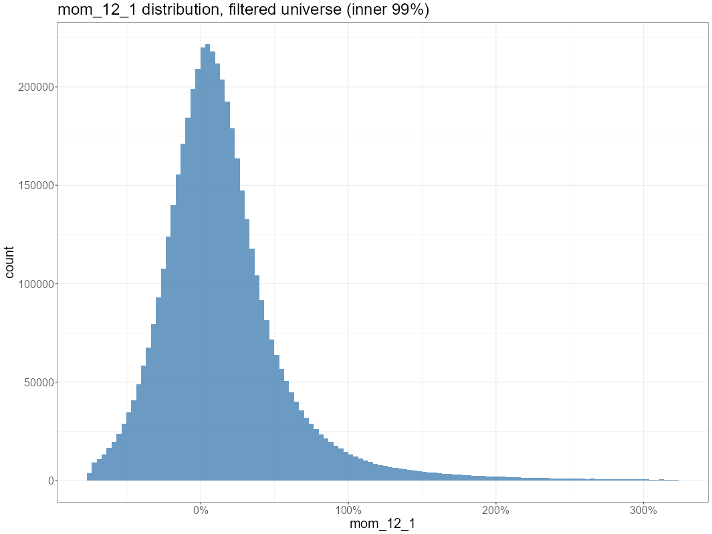

The distribution has a long right tail and is bounded on the left near -100% (a stock can't lose more than its entire value). The right skew is typical for equity returns — a few stocks compound dramatically over 12 months while many cluster near zero.

### Decile mean forward returns

```r
mom_buckets <- ft %>%
  filter(!is.na(mom_12_1)) %>%
  bucket_factor("mom_12_1")

decile_summary <- mom_buckets %>%
  group_by(decile) %>%
  summarise(
    n       = n(),
    fwd_5   = mean(fwd_5,   na.rm = TRUE),
    fwd_20  = mean(fwd_20,  na.rm = TRUE),
    fwd_60  = mean(fwd_60,  na.rm = TRUE),
    fwd_120 = mean(fwd_120, na.rm = TRUE),
    .groups = "drop"
  )
```

This code does two distinct things worth separating conceptually.

**`mom_buckets`** is the core intermediate object that almost everything downstream reuses. `bucket_factor("mom_12_1")` runs the cross-sectional sort: on each individual trading day, it ranks every stock in the universe by its `mom_12_1` value and assigns it to one of 10 deciles — D1 gets the bottom 10% (the biggest losers over the past year), D10 gets the top 10% (the biggest winners). Crucially this ranking is done independently on each date, so a stock's decile assignment reflects its position relative to its peers *on that day*, not in some absolute sense.

**`decile_summary`** then collapses `mom_buckets` across all dates and all stocks within each decile, computing the mean forward return at four horizons. This answers: "pooling across the entire sample, what was the average forward return for a stock that happened to be in decile X on any given day?"

What you're looking for:
- **Monotonicity** — does mean forward return increase steadily from D1 to D10? A clean monotonic gradient is the core evidence that the signal has predictive power. Gaps, inversions, or a flat middle are informative deviations.
- **The D10-D1 spread** — the raw magnitude of the "edge". This is the number quoted when people say momentum delivers ~57 bps over 20 days.
- **How the gradient changes across horizons** — does the spread get stronger or weaker at 60 vs 20 days? Widening suggests the signal continues diffusing; narrowing suggests it peaks early and then mean-reverts.

The multiple horizons (`fwd_5` through `fwd_120`) matter because the right holding period for a momentum strategy isn't obvious from theory alone. If the spread is strong at `fwd_5` but collapses by `fwd_60`, the natural cadence is weekly rebalancing; if it builds out to `fwd_120`, you can afford to be much less active. The charts that follow answer exactly this.

```r
# faceted decile chart across horizons (fixed scale)
decile_summary %>%
  pivot_longer(starts_with("fwd_"), names_to = "horizon", values_to = "mean_ret") %>%
  mutate(horizon = factor(horizon, levels = c("fwd_5", "fwd_20", "fwd_60", "fwd_120"))) %>%
  ggplot(aes(decile, mean_ret)) +
  geom_bar(stat = "identity", fill = "steelblue") +
  scale_y_continuous(labels = percent_format(accuracy = 0.1)) +
  scale_x_continuous(breaks = 1:10) +
  facet_wrap(~ horizon) +
  labs(title = "mom_12_1: mean forward return by decile",
       subtitle = "monotonic gradient from D1 to D10 is what we want to see",
       x = "decile (1 = low mom, 10 = high mom)", y = "mean forward return")
```

This chart is answering two questions simultaneously:

**1. Is the signal monotonic?** Does mean forward return increase steadily from D1 through D10, or does the gradient have inversions (e.g. D1 outperforming D2, or D7 beating D10)? Monotonicity is the basic test of whether the ranking has real predictive content. A factor where only the extreme tails work (D1 and D10 differ, but the middle is flat) tells a different implementability story than one with a clean gradient all the way through.

**2. Does the gradient shape hold across holding periods?** By faceting on `fwd_5`, `fwd_20`, `fwd_60`, `fwd_120` on a **fixed y-axis scale**, you can directly compare the *magnitude* of the spread across horizons. Does the signal get stronger or weaker as you hold longer? Does the gradient compress toward zero by `fwd_120`, or does it widen? This tells you how quickly the predictive power decays and therefore what holding period the signal naturally supports.

The fixed scale is the key design choice here — it's what makes the second question answerable from this chart. The free-scale version (the next chart) answers a different question: what is the *shape* of the gradient at each horizon regardless of magnitude. Both are needed because a fixed scale can make a real but small gradient at `fwd_5` look flat, while a free scale can make a tiny residual signal at `fwd_120` look impressively monotonic.

```r
# faceted decile chart across horizons (free scale — shows gradient shape more clearly)
decile_summary %>%
  pivot_longer(starts_with("fwd_"), names_to = "horizon", values_to = "mean_ret") %>%
  mutate(horizon = factor(horizon, levels = c("fwd_5", "fwd_20", "fwd_60", "fwd_120"))) %>%
  ggplot(aes(decile, mean_ret)) +
  geom_bar(stat = "identity", fill = "steelblue") +
  scale_y_continuous(labels = percent_format(accuracy = 0.1)) +
  scale_x_continuous(breaks = 1:10) +
  facet_wrap(~ horizon, scales = "free_y") +
  labs(title = "mom_12_1: mean forward return by decile",
       subtitle = "Different scales to show gradient shape clearly at each horizon",
       x = "decile (1 = low mom, 10 = high mom)", y = "mean forward return")
```

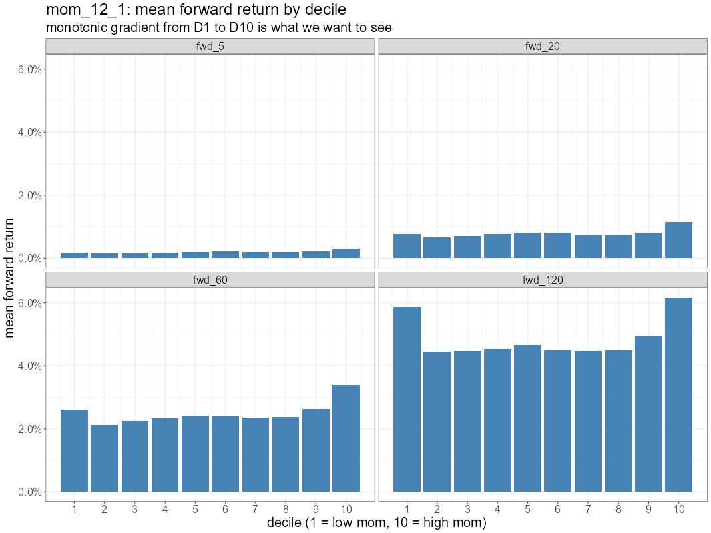

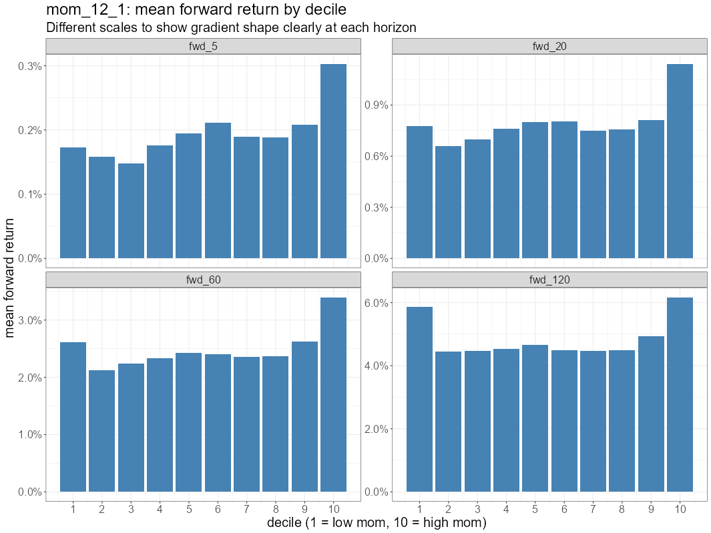

**Key observation:** D10 (winners) has the highest forward returns. But D1 (losers) does *not* have the lowest — it bounces, sitting above D2 in every horizon. This is the short-term reversal contamination coming through even after the 21-day skip. The bottom decile is a mix of stocks that have genuinely lost momentum and stocks that just sold off sharply and are about to bounce. We'll investigate this more in section 7B.

### Year-by-year stability

```r
decile_summary_annual <- mom_buckets %>%
  mutate(year = year(date)) %>%
  group_by(year, decile) %>%
  summarise(
    n         = n(),
    mean_ret  = mean(fwd_5, na.rm = TRUE),
    .groups = "drop"
  )

decile_summary_annual %>%
  ggplot(aes(decile, mean_ret)) +
  geom_bar(stat = "identity", fill = "steelblue") +
  scale_y_continuous(labels = percent_format(accuracy = 0.1)) +
  scale_x_continuous(breaks = 1:10) +
  facet_wrap(~ year, scales = "free_y") +
  labs(title = "mom_12_1: mean forward return by decile",
       subtitle = "Different scales to show gradient shape clearly at each horizon",
       x = "decile (1 = low mom, 10 = high mom)", y = "mean forward return")
```

```r
# year-by-year D10 - D1 spread on fwd_20
annual_spread <- mom_buckets %>%
  filter(decile %in% c(1, 10), !is.na(fwd_20)) %>%
  mutate(year = year(date)) %>%
  group_by(year, decile) %>%
  summarise(mean_ret = mean(fwd_20), .groups = "drop") %>%
  pivot_wider(names_from = decile, values_from = mean_ret, names_prefix = "d") %>%
  mutate(spread = d10 - d1)

annual_spread %>%
  ggplot(aes(as.factor(year), spread, fill = spread > 0)) +
  geom_col(show.legend = FALSE) +
  scale_y_continuous(labels = percent_format(accuracy = 0.1)) +
  scale_fill_manual(values = c("TRUE" = "steelblue", "FALSE" = "firebrick")) +
  labs(title = "mom_12_1: annual D10 - D1 spread on fwd_20",
       subtitle = "How consistent is the momentum factor?",
       x = NULL, y = "D10 - D1 mean fwd_20")
```

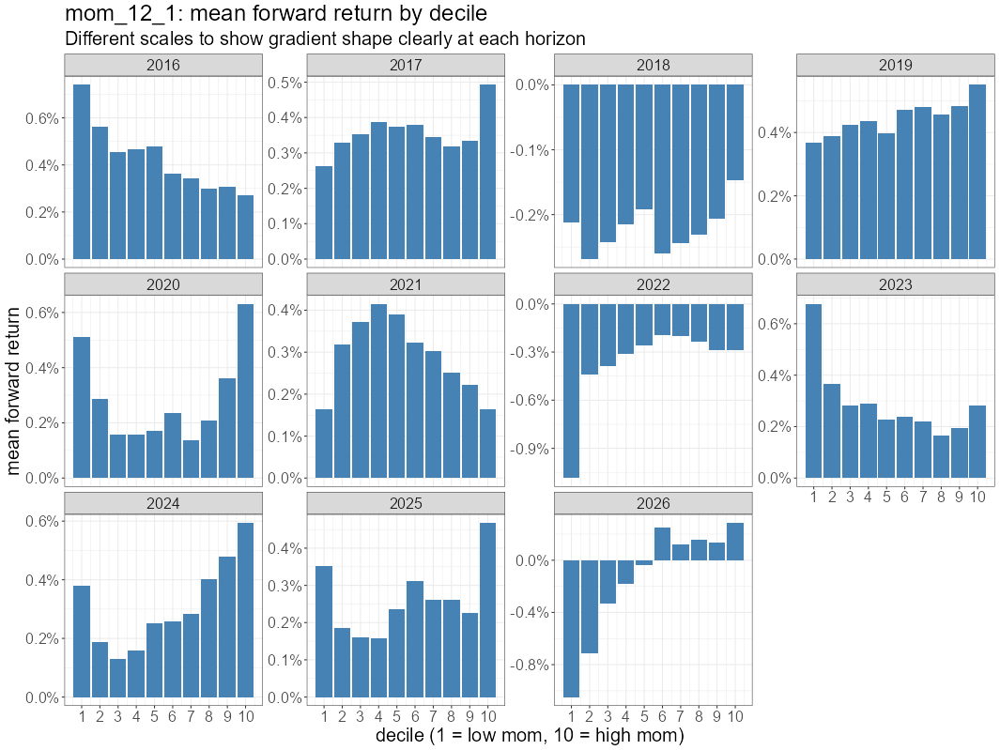

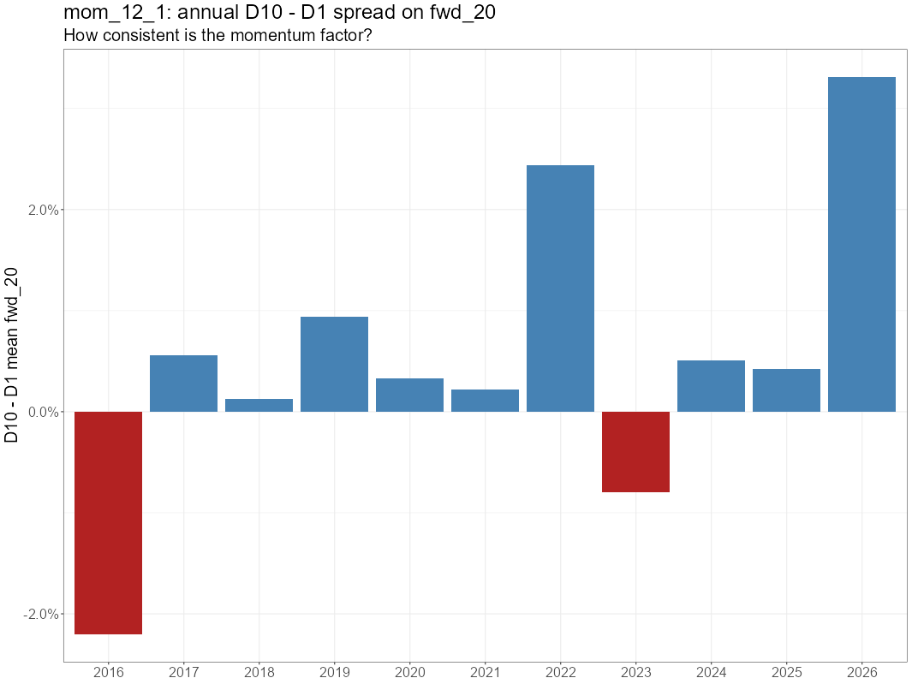

2016 and 2022 are notable outliers (both negative). 2016 saw the factor reverse hard after the US election as "loser" sectors like energy and financials rallied sharply. 2022 saw violent sector rotation driven by rate shock. These years tell us the factor is not bulletproof; it fails in specific macro regimes.

### Turnover proxy

```r
persistence <- mom_buckets %>%
  arrange(ticker, date) %>%
  group_by(ticker) %>%
  mutate(prev_decile = lag(decile)) %>%
  ungroup() %>%
  filter(!is.na(prev_decile)) %>%
  summarise(
    same_decile_pct = mean(decile == prev_decile),
    moved_one       = mean(abs(decile - prev_decile) <= 1),
    big_move        = mean(abs(decile - prev_decile) >= 3)
  )
persistence
```

~82% of the time, a stock stays in the same decile from one day to the next. (The `persistence` tibble prints the exact numbers.) This is expected for a 252-day signal — yesterday's 12-month winner is almost certainly still a 12-month winner today. Low turnover means transaction costs are not a major concern for this signal if we aren't rebalancing aggressively.

### Cumulative cost-free returns

```r
# proportional-weight version
daily_ls <- mom_buckets %>%
  mutate(position = decile - 5.5) |>
  group_by(date) %>%
  mutate(weight = position / sum(abs(position), na.rm = TRUE)) %>%
  summarise(mean_ret = sum(weight * fwd_1, na.rm = TRUE), .groups = "drop")

daily_ls <- daily_ls %>%
  mutate(cum_return = cumsum(tidyr::replace_na(mean_ret, 0)))

daily_ls %>%
  ggplot(aes(date, cum_return)) +
  geom_line(linewidth = 0.8) +
  scale_y_continuous(labels = percent_format(accuracy = 1)) +
  labs(title = "Cumulative cost-free mom_12_1",
       subtitle = "Weights in proportion to factor decile",
       x = NULL, y = "cumulative log return", colour = NULL)
```

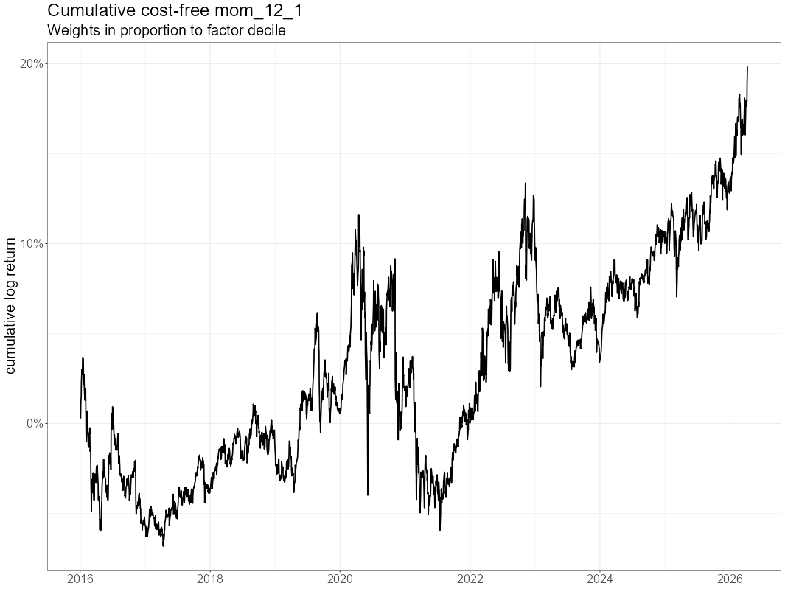

```r
daily_ls %>%
  summarise(
    total_return = last(cum_return),
    sharpe       = mean(mean_ret) / sd(mean_ret) * sqrt(252)
  )
```

```r
# D10 - D1 version
daily_ls <- mom_buckets %>%
  filter(decile %in% c(1, 10), !is.na(fwd_1)) %>%
  group_by(date, decile) %>%
  summarise(mean_ret = mean(fwd_1), .groups = "drop") %>%
  pivot_wider(names_from = decile, values_from = mean_ret, names_prefix = "d") %>%
  mutate(ls = d10 - d1) %>%
  arrange(date)

daily_ls <- daily_ls %>%
  mutate(cum_return = cumsum(tidyr::replace_na(ls, 0)))

daily_ls %>%
  ggplot(aes(date, cum_return)) +
  geom_line(linewidth = 0.8) +
  scale_y_continuous(labels = percent_format(accuracy = 1)) +
  labs(title = "Cumulative cost-free mom_12_1 L/S",
       subtitle = "D10 - D1",
       x = NULL, y = "cumulative log return", colour = NULL)
```

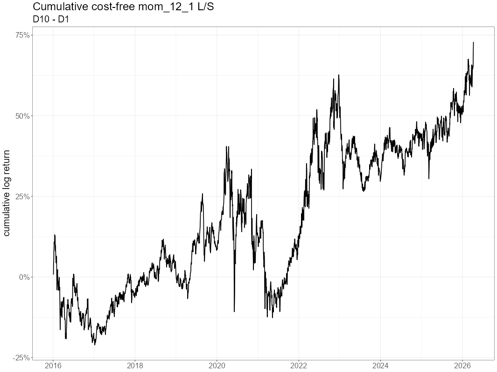

```r
daily_ls %>%
  summarise(
    total_return = last(cum_return),
    sharpe       = mean(ls) / sd(ls) * sqrt(252)
  )
```

---

## 6. Taking Stock

The canonical 12-1 momentum spec "works". The decile gradient goes in the right direction from D1 to D10 at fwd_20 (notwithstanding the reversal in D1), and the top-minus-bottom spread lands at about **+57 bps** over the 20-day forward. That's consistent with published academic results for the US cross-section.

But the picture is less clean than the cross-section alone suggests:

- **The Sharpe of the factor return doesn't match what the cross-section implies.** The D10-D1 Sharpe is only ~0.26 with a total cumulative log return of ~0.73. A +57 bps fwd_20 spread accumulated daily *should* deliver a higher Sharpe. The gap between "the cross-section says there's an edge" and "the daily equity curve is underwhelming" is a tell — one strong explanation would be if the premium is concentrated in specific days of the month, not spread evenly across the calendar.
- **Turnover is negligible.** Day-over-day decile persistence is very high. This is consistent with a slow signal that likely doesn't need to be touched daily.
- **The D1 reversal bump deserves more attention.** The bottom decile consistently outperforms the second-lowest decile. This is residual short-term reversal contamination.

**This sets up the key questions for the rest of the notebook:**
1. Where does the factor flip from reversal to momentum in the lookback?
2. Is the premium concentrated in a specific window of the month?
3. Does the edge survive in the liquid end of the universe?
4. Does it survive standard conditioning controls (vol, beta, sector)?

---

## 7A. Momentum Lookback Sweep

**Research question:** At what lookback does the factor flip from mean reversion to momentum, and where does the spread peak?

At short horizons, buying recent winners loses money — that's short-term reversal. Somewhere at a longer lookback, the sign flips and you get momentum. Finding the crossover tells us something about what mechanism is actually driving the effect.

```r
sweep_specs <- tribble(
  ~spec,        ~lookback, ~skip,
  "mom_5",          5,        0,
  "mom_10_0",      10,        0,
  "mom_21_0",      21,        0,
  "mom_21_5",      21,        5,
  "mom_63_10",     63,       10,
  "mom_63_21",     63,       21,
  "mom_126_10",   126,       10,
  "mom_126_21",   126,       21,
  "mom_12_1",     252,       21,
  "mom_12_2",     252,       42
)

sweep_long <- ft %>%
  select(ticker, date, all_of(sweep_specs$spec), fwd_5) %>%
  pivot_longer(cols = all_of(sweep_specs$spec), names_to = "spec", values_to = "value") %>%
  filter(!is.na(value), !is.na(fwd_5))

sweep_buckets <- sweep_long %>%
  group_by(spec, date) %>%
  mutate(decile = ntile(value, 10)) %>%
  ungroup()

sweep_result <- sweep_buckets %>%
  filter(decile %in% c(1, 10)) %>%
  group_by(spec, decile) %>%
  summarise(mean_fwd_5 = mean(fwd_5), .groups = "drop") %>%
  pivot_wider(names_from = decile, values_from = mean_fwd_5, names_prefix = "d") %>%
  mutate(spread_bps = (d10 - d1) * 1e4) %>%
  left_join(sweep_specs, by = "spec") %>%
  arrange(lookback, skip)

sweep_result
```

```r
sweep_result %>%
  mutate(skip_label = if_else(skip == 0, "no skip", paste0("skip ", skip, "d"))) %>%
  ggplot(aes(lookback, spread_bps, colour = skip_label, group = skip_label)) +
  geom_hline(yintercept = 0, linetype = "dashed", colour = "grey50") +
  geom_line(linewidth = 1) +
  geom_point(size = 3) +
  scale_x_log10(breaks = c(5, 10, 21, 63, 126, 252)) +
  labs(title = "Momentum flips to reversal at short lookbacks",
       subtitle = "D10 - D1 mean fwd_5 spread in bps, by lookback window",
       x = "lookback (trading days, log scale)", y = "spread (bps, fwd_5)",
       colour = NULL)
```

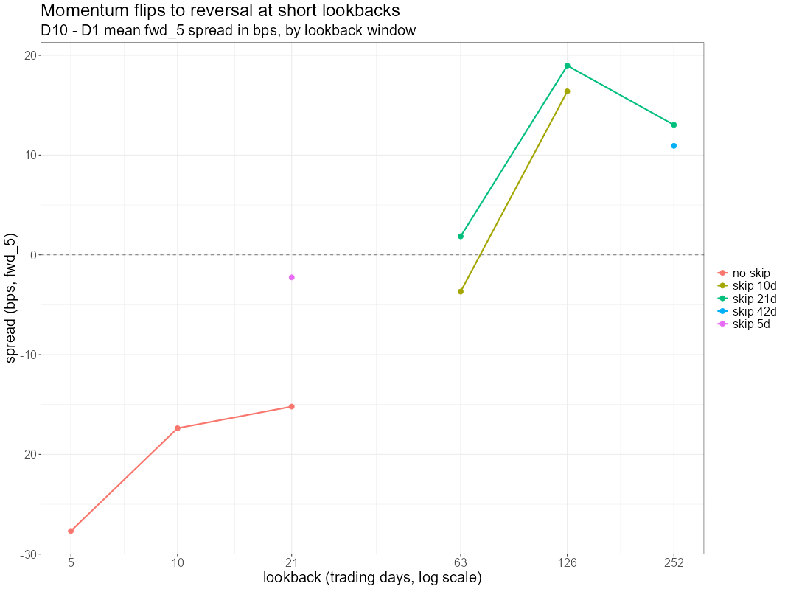

For better signal-to-noise, repeat with `fwd_20`:

```r
sweep_long <- ft %>%
  select(ticker, date, all_of(sweep_specs$spec), fwd_20) %>%
  pivot_longer(cols = all_of(sweep_specs$spec), names_to = "spec", values_to = "value") %>%
  filter(!is.na(value), !is.na(fwd_20))

sweep_buckets <- sweep_long %>%
  group_by(spec, date) %>%
  mutate(decile = ntile(value, 10)) %>%
  ungroup()

sweep_result <- sweep_buckets %>%
  filter(decile %in% c(1, 10)) %>%
  group_by(spec, decile) %>%
  summarise(mean_fwd_20 = mean(fwd_20), .groups = "drop") %>%
  pivot_wider(names_from = decile, values_from = mean_fwd_20, names_prefix = "d") %>%
  mutate(spread_bps = (d10 - d1) * 1e4) %>%
  left_join(sweep_specs, by = "spec") %>%
  arrange(lookback, skip)

print(sweep_result)

sweep_result %>%
  mutate(skip_label = if_else(skip == 0, "no skip", paste0("skip ", skip, "d"))) %>%
  ggplot(aes(lookback, spread_bps, colour = skip_label, group = skip_label)) +
  geom_hline(yintercept = 0, linetype = "dashed", colour = "grey50") +
  geom_line(linewidth = 1) +
  geom_point(size = 3) +
  scale_x_log10(breaks = c(5, 10, 21, 63, 126, 252)) +
  labs(title = "Momentum flips to reversal at short lookbacks",
       subtitle = "D10 - D1 mean fwd_20 spread in bps, by lookback window",
       x = "lookback (trading days, log scale)", y = "spread (bps, fwd_20)",
       colour = NULL)
```

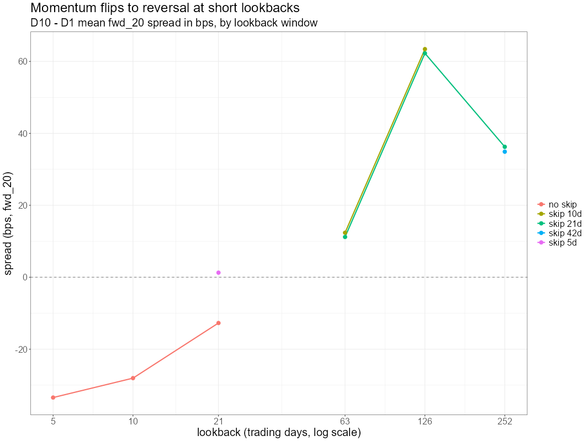

**Findings:** Short-end specs (mom_5, mom_10, mom_21) show a **negative** spread — buying recent winners loses money (short-term reversal is real). The spread crosses zero somewhere between 21 and 63 days, and by 63 days is comfortably positive. It stays positive out to 252 days. Interestingly, the 126-day spec (`mom_126_21`) appears competitive with or better than the canonical 252-day spec, suggesting the 12-month lookback may not be optimal in this universe. Skip versions don't look dramatically different at the fwd_20 horizon.

---

## 7B. Does the Skip Matter?

**Research question:** How much does the 1-month skip actually buy us? Is `mom_12_1` (21-day skip) cleaner than `mom_12_0` (no skip)?

```r
skip_compare <- ft %>%
  group_by(ticker) %>% arrange(date, .by_group = TRUE) %>%
  mutate(mom_12_0 = closeadj / lag(closeadj, 252) - 1) %>%
  ungroup() %>%
  filter(!is.na(mom_12_0), !is.na(mom_12_1), !is.na(fwd_20))

skip_compare_buckets <- skip_compare %>%
  select(ticker, date, mom_12_0, mom_12_1, fwd_20) %>%
  pivot_longer(c(mom_12_0, mom_12_1), names_to = "spec", values_to = "value") %>%
  group_by(spec, date) %>%
  mutate(decile = ntile(value, 10)) %>%
  ungroup()

skip_compare_buckets %>%
  filter(decile %in% c(1, 10)) %>%
  group_by(spec, decile) %>%
  summarise(mean_fwd_20 = mean(fwd_20), .groups = "drop") %>%
  pivot_wider(names_from = decile, values_from = mean_fwd_20, names_prefix = "d") %>%
  mutate(spread_bps = (d10 - d1) * 1e4)
```

**Findings:** The skipped spec beats the non-skipped spec by ~5-6 bps per month. The 1-month skip is a short-term reversal filter — without it, the top decile is contaminated with stocks that just spiked and are about to mean-revert, and the bottom decile contains stocks that just sold off and are about to bounce.

**The D1 non-monotonicity question.** The decile gradient showed D1 (biggest losers) with *higher* forward returns than D2. Does a longer skip remove it?

```r
skip_features <- ft %>%
  group_by(ticker) %>% arrange(date, .by_group = TRUE) %>%
  mutate(
    mom_252_0  = closeadj / lag(closeadj, 252) - 1,
    mom_252_21 = lag(closeadj, 21) / lag(closeadj, 252) - 1,
    mom_252_42 = lag(closeadj, 42) / lag(closeadj, 252) - 1,
    mom_252_63 = lag(closeadj, 63) / lag(closeadj, 252) - 1
  ) %>%
  ungroup()

skip_decile_gradients <- purrr::map_dfr(
  c("mom_252_0", "mom_252_21", "mom_252_42", "mom_252_63"),
  function(spec) {
    skip_features %>%
      filter(!is.na(.data[[spec]]), !is.na(fwd_20)) %>%
      bucket_factor(spec) %>%
      group_by(decile) %>%
      summarise(mean_fwd20 = mean(fwd_20, na.rm = TRUE) * 1e4, .groups = "drop") %>%
      mutate(spec = spec)
  }
)

skip_decile_gradients %>%
  mutate(spec = factor(spec, levels = c("mom_252_0", "mom_252_21", "mom_252_42", "mom_252_63"))) %>%
  ggplot(aes(factor(decile), mean_fwd20, fill = spec)) +
  geom_col(position = position_dodge(width = 0.8), width = 0.7) +
  geom_hline(yintercept = 0, linetype = "dashed", colour = "grey50") +
  labs(title = "full decile gradient at 252-day lookback, varying skip length",
       subtitle = "does a longer skip clean the D1 reversal bump?",
       x = "decile", y = "mean fwd_20 (bps)") +
  theme_minimal()

# numeric: D1 vs D2 gap for each spec
skip_decile_gradients %>%
  filter(decile %in% c(1, 2, 10)) %>%
  pivot_wider(names_from = decile, values_from = mean_fwd20, names_prefix = "d") %>%
  mutate(
    d1_minus_d2_bps  = d1 - d2,
    d10_minus_d1_bps = d10 - d1
  ) %>%
  select(spec, d1, d2, d1_minus_d2_bps, d10_minus_d1_bps)
```

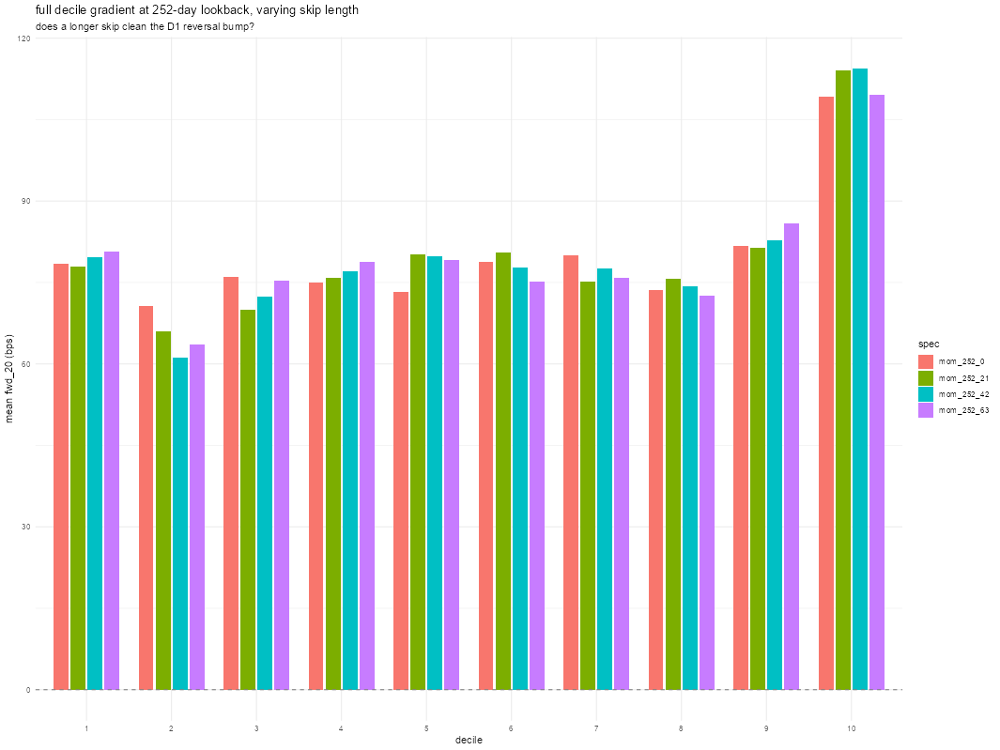

**Findings:** The D1-D2 spread actually **grows** with a longer skip. Increasing the skip beyond 21 days does *not* fix the D1 bounce — it widens it. This suggests the reversal contamination in D1 is more about magnitude than recency: the extreme losers are a special population whose reversal is not explained by a simple "too recent" window. The canonical 12-1 spec also delivers the largest D10-D1 spread, which is probably why it's canonical.

---

## 7C. The Intramonth Momentum Cycle (PreTOM)

This is the most important section. Nathan, Suominen and Tasa (2026) show that in US equities from 1980 onwards, the momentum premium is concentrated in a specific 6-day window each month: trading days T-9 through T-4, where T=0 is the last trading day of the month. They call this the **PreTOM window**.

The paper's proposed mechanism: mutual funds and pensions have to raise cash around month-end for redemptions, T+2 settlement, and month-end accounting. When funds sell, they sell the losers — lower dividend yields, already have unrealised losses (tax-efficient), fewer internal defenders. The selling concentrates into the week before month-end (T-9 to T-4) because by T-3 everyone is trying to avoid the end-of-month rush.

If this replicates in this data, a daily-rebalanced momentum strategy is paying turnover costs on ~15 "nothing" days for every 6 productive days. The natural cadence of the factor would be monthly, not daily.

### Step 1: Build the within-month T-index

```r
trading_dates <- ft %>%
  distinct(date) %>%
  arrange(date) %>%
  mutate(month = floor_date(date, "month")) %>%
  group_by(month) %>%
  mutate(
    rev_rank = row_number(desc(date)),   # 1 = last trading day of month
    t_index  = -(rev_rank - 1)           # 0 = last trading day, -1 = penultimate, ...
  ) %>%
  ungroup() %>%
  mutate(pretom = t_index >= -9 & t_index <= -4) %>%
  select(date, t_index, pretom)

trading_dates %>% head(25)
trading_dates %>% count(pretom)
```

### Step 2: Tag daily L/S returns with PreTOM flag

```r
daily_ls <- mom_buckets %>%
  filter(decile %in% c(1, 10), !is.na(fwd_1)) %>%
  group_by(date, decile) %>%
  summarise(mean_ret = mean(fwd_1), .groups = "drop") %>%
  pivot_wider(names_from = decile, values_from = mean_ret, names_prefix = "d") %>%
  mutate(ls = d10 - d1) %>%
  inner_join(trading_dates, by = "date") %>%
  arrange(date)

daily_ls <- daily_ls %>%
  mutate(
    ls_pretom_only     = if_else(pretom,  ls, 0),
    ls_non_pretom_only = if_else(!pretom, ls, 0),
    cum_always         = cumsum(tidyr::replace_na(ls, 0)),
    cum_pretom         = cumsum(tidyr::replace_na(ls_pretom_only, 0)),
    cum_non_pretom     = cumsum(tidyr::replace_na(ls_non_pretom_only, 0))
  )
```

### Headline: mean daily spread on vs off PreTOM

```r
pretom_headline <- daily_ls %>%
  group_by(pretom) %>%
  summarise(
    n         = n(),
    mean_bps  = mean(ls, na.rm = TRUE) * 1e4,
    sd_bps    = sd(ls,   na.rm = TRUE) * 1e4,
    .groups = "drop"
  )

print(pretom_headline)

pretom_headline %>%
  ggplot(aes(x = pretom, y = mean_bps, fill = pretom)) +
  geom_col(show.legend = FALSE) +
  geom_errorbar(aes(ymin = mean_bps - sd_bps, ymax = mean_bps + sd_bps), width = 0.2) +
  scale_x_discrete(labels = c("Non-PreTOM", "PreTOM")) +
  labs(title = "Mean daily D10 - D1 spread (bps) on vs off PreTOM window",
       subtitle = "Error bars show ±1 standard deviation",
       x = NULL, y = "mean spread (bps)")
```

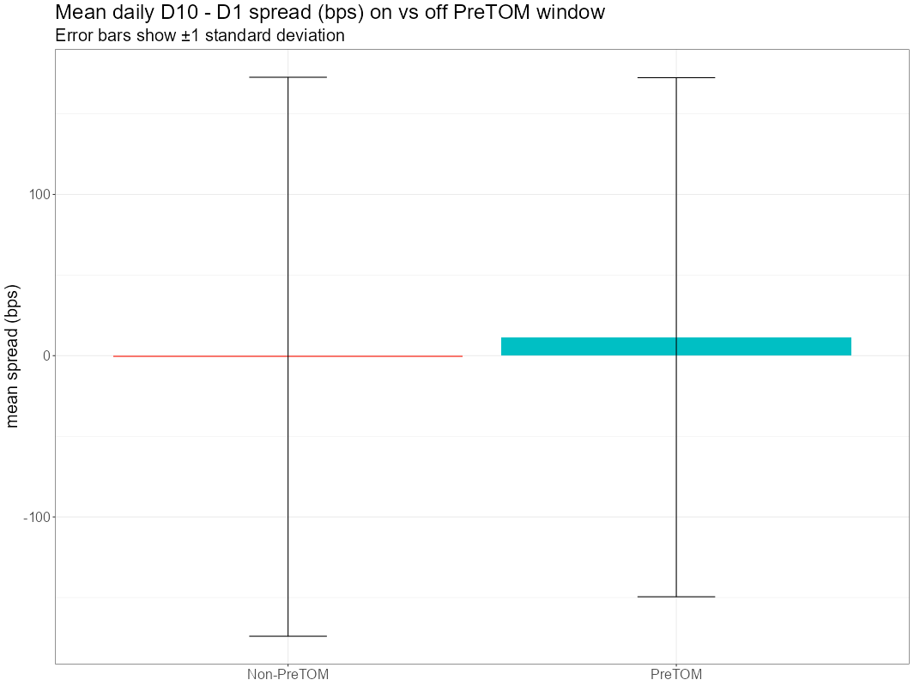

**Stunning finding:** The D10-D1 spread is actually **negative** outside the PreTOM period, on average. The PreTOM window captures not just a disproportionate share of the returns — it captures *all* of them, and then some.

### Side decomposition: is it D1 or D10 driving this?

```r
side_decomp <- mom_buckets %>%
  filter(decile %in% c(1, 10), !is.na(fwd_1)) %>%
  inner_join(trading_dates, by = "date") %>%
  group_by(pretom, decile) %>%
  summarise(mean_bps = mean(fwd_1) * 1e4, .groups = "drop") %>%
  mutate(decile_label = if_else(decile == 1, "D1 (losers)", "D10 (winners)"),
         window_label = if_else(pretom, "PreTOM (T-9..T-4)", "rest of month"))
side_decomp
```

```r
side_decomp %>%
  ggplot(aes(window_label, mean_bps, fill = decile_label)) +
  geom_col(position = position_dodge(width = 0.8), width = 0.7) +
  geom_hline(yintercept = 0, linetype = "dashed", colour = "grey50") +
  scale_fill_manual(values = c("D1 (losers)" = "firebrick", "D10 (winners)" = "steelblue")) +
  labs(title = "Is the PreTOM effect loser-driven?",
       subtitle = "Mean daily fwd_1 return in bps, by decile and window",
       x = NULL, y = "Mean daily return (bps)", fill = NULL)
```

```r
# quantify the PreTOM lift for each leg
side_decomp %>%
  select(pretom, decile_label, mean_bps) %>%
  pivot_wider(names_from = pretom, values_from = mean_bps) %>%
  rename(non_pretom = `FALSE`, pretom = `TRUE`) %>%
  mutate(pretom_effect_bps = pretom - non_pretom)
```

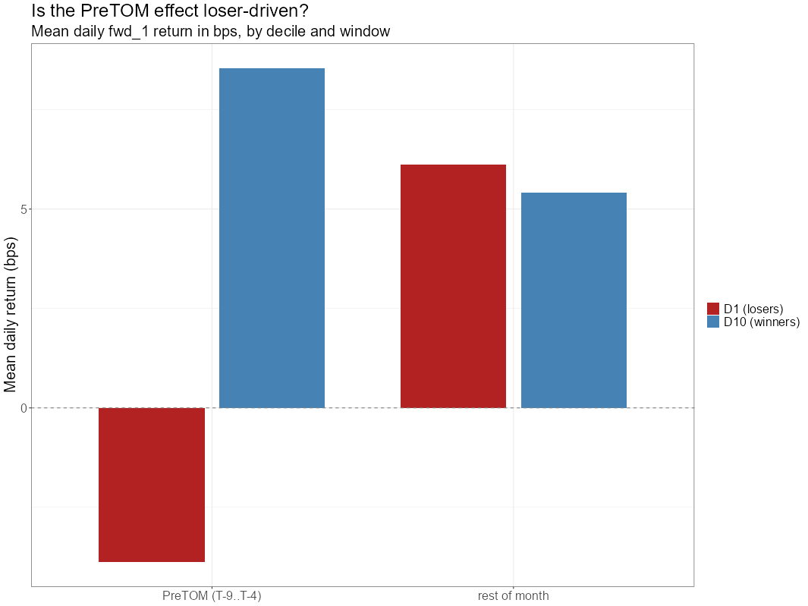

**Findings:** The loser side (D1) is the dominant story. D1 has a *negative* average return during the PreTOM window — losers fall sharply. For the rest of the month, D1 is slightly positive (the bounce). The PreTOM vs non-PreTOM swing on D1 is roughly 10 bps. D10 shows a +3 bps increase during PreTOM — real but less than one-third the D1 swing. This is consistent with "institutional dash for cash" selling concentrated in the loser names.

### Cumulative equity curves

```r
daily_ls %>%
  select(date, cum_always, cum_pretom, cum_non_pretom) %>%
  pivot_longer(-date, names_to = "series", values_to = "cum") %>%
  mutate(series = recode(series,
                         cum_always = "always-in",
                         cum_pretom = "PreTOM only (T-9..T-4)",
                         cum_non_pretom = "rest of month only")) %>%
  ggplot(aes(date, cum, colour = series)) +
  geom_line(linewidth = 0.8) +
  scale_y_continuous(labels = percent_format(accuracy = 1)) +
  labs(title = "Cumulative cost-free mom_12_1 L/S, decomposed by window",
       x = NULL, y = "Cumulative log return", colour = NULL)
```

```r
daily_ls %>%
  select(date, ls, ls_pretom_only, ls_non_pretom_only) %>%
  pivot_longer(-date, names_to = "series", values_to = "ret") %>%
  group_by(series) %>%
  summarise(
    total_return = last(cumsum(tidyr::replace_na(ret, 0))),
    sharpe       = mean(ret, na.rm = TRUE) / sd(ret, na.rm = TRUE) * sqrt(252),
    .groups = "drop"
  )
```

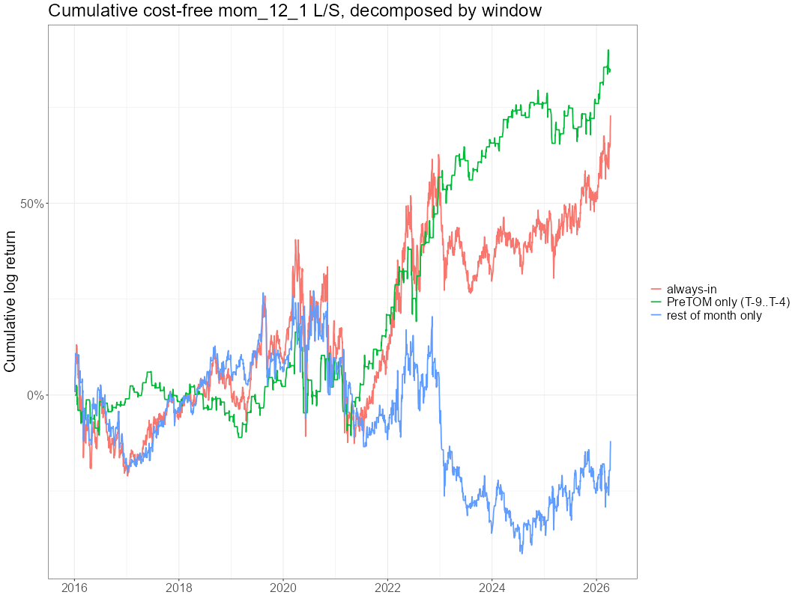

### Which days actually carry the premium?

The paper defines the PreTOM window as T-9 to T-4. How sharp are those boundaries?

```r
daily_by_tday <- daily_ls %>% mutate(t_day = t_index)

daily_by_tday <- daily_by_tday %>%
  mutate(t_label = paste0("T", t_day))

tday_summary <- daily_by_tday %>%
  group_by(t_day, t_label) %>%
  summarise(
    n = n(),
    mean_bps = mean(ls, na.rm = TRUE) * 1e4,
    sd_bps   = sd(ls,   na.rm = TRUE) * 1e4,
    .groups = "drop"
  )

tday_summary %>%
  mutate(in_pretom = t_day <= -4 & t_day >= -9) %>%
  ggplot(aes(x = reorder(t_label, t_day), y = mean_bps, fill = in_pretom)) +
  geom_col(show.legend = FALSE) +
  geom_hline(yintercept = 0, linetype = "dashed", colour = "grey50") +
  scale_fill_manual(values = c("FALSE" = "steelblue", "TRUE" = "firebrick")) +
  labs(title = "mean daily D10-D1 spread by trading day (counting back from month-end)",
       subtitle = "red = paper's PreTOM window (T-9 to T-4). is the effect sharply defined?",
       x = "trading day index", y = "mean daily spread (bps)") +
  theme_minimal(base_size = 11) +
  theme(axis.text.x = element_text(angle = 45, hjust = 1))

tday_summary %>% arrange(desc(mean_bps))
```

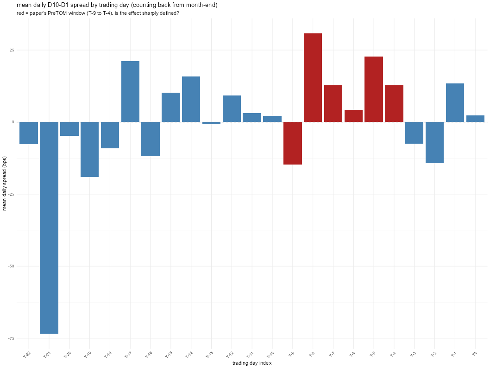

Faceted by year to see stability:

```r
daily_by_tday %>%
  mutate(year = year(date), in_pretom = t_day <= -4 & t_day >= -9) %>%
  group_by(year, t_day, t_label, in_pretom) %>%
  summarise(mean_bps = mean(ls, na.rm = TRUE) * 1e4, .groups = "drop") %>%
  ggplot(aes(x = reorder(t_label, t_day), y = mean_bps, fill = in_pretom)) +
  geom_col(show.legend = FALSE) +
  geom_hline(yintercept = 0, linetype = "dashed", colour = "grey50") +
  scale_fill_manual(values = c("FALSE" = "steelblue", "TRUE" = "firebrick")) +
  facet_wrap(~ year, scales = "free_y") +
  labs(title = "daily momentum spread by trading day, faceted by year",
       subtitle = "red = PreTOM window. does the pattern hold consistently?",
       x = NULL, y = "spread (bps)") +
  theme_minimal(base_size = 9) +
  theme(axis.text.x = element_text(angle = 90, hjust = 1, size = 5))
```

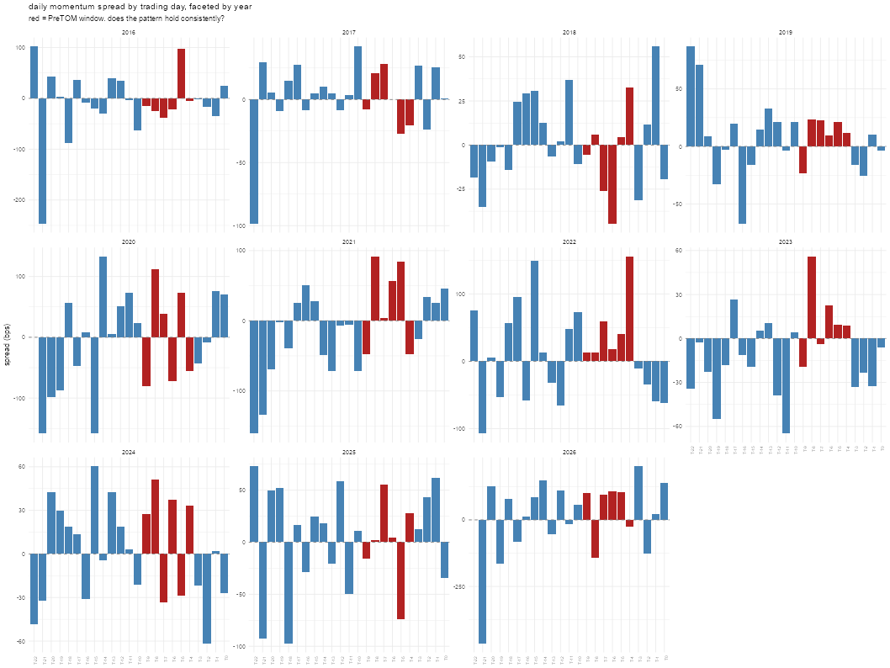

And in 3-year rolling blocks:

```r
daily_by_tday %>%
  mutate(
    year = year(date),
    block = case_when(
      year <= 2017 ~ "2015-2017",
      year <= 2020 ~ "2018-2020",
      year <= 2023 ~ "2021-2023",
      TRUE         ~ "2024+"
    ),
    in_pretom = t_day <= -4 & t_day >= -9
  ) %>%
  group_by(block, t_day, t_label, in_pretom) %>%
  summarise(mean_bps = mean(ls, na.rm = TRUE) * 1e4, .groups = "drop") %>%
  ggplot(aes(x = reorder(t_label, t_day), y = mean_bps, fill = in_pretom)) +
  geom_col(show.legend = FALSE) +
  geom_hline(yintercept = 0, linetype = "dashed", colour = "grey50") +
  scale_fill_manual(values = c("FALSE" = "steelblue", "TRUE" = "firebrick")) +
  facet_wrap(~ block) +
  labs(title = "daily momentum spread by trading day, 4-year blocks",
       x = NULL, y = "spread (bps)") +
  theme_minimal(base_size = 10) +
  theme(axis.text.x = element_text(angle = 45, hjust = 1))
```

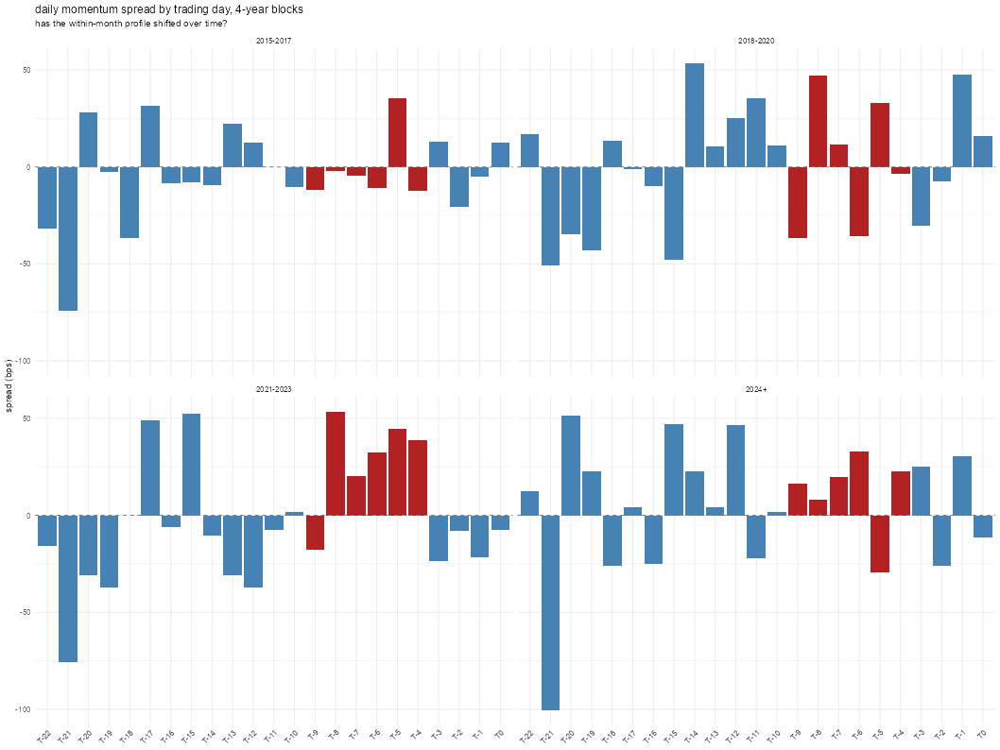

Second half vs first half comparison by year:

```r
daily_by_tday %>%
  mutate(
    year       = year(date),
    month_part = case_when(t_day <= -11 ~ "first half", TRUE ~ "second half")
  ) %>%
  group_by(year, month_part) %>%
  summarise(mean_bps = mean(ls, na.rm = TRUE) * 1e4, .groups = "drop") %>%
  ggplot(aes(factor(year), mean_bps, fill = month_part)) +
  geom_col(position = position_dodge(width = 0.8), width = 0.7) +
  geom_hline(yintercept = 0, linetype = "dashed", colour = "grey50") +
  scale_fill_manual(values = c("first half" = "steelblue", "second half" = "firebrick")) +
  labs(title = "mean daily momentum spread, by month part and year",
       x = NULL, y = "mean daily spread (bps)", fill = NULL)
```

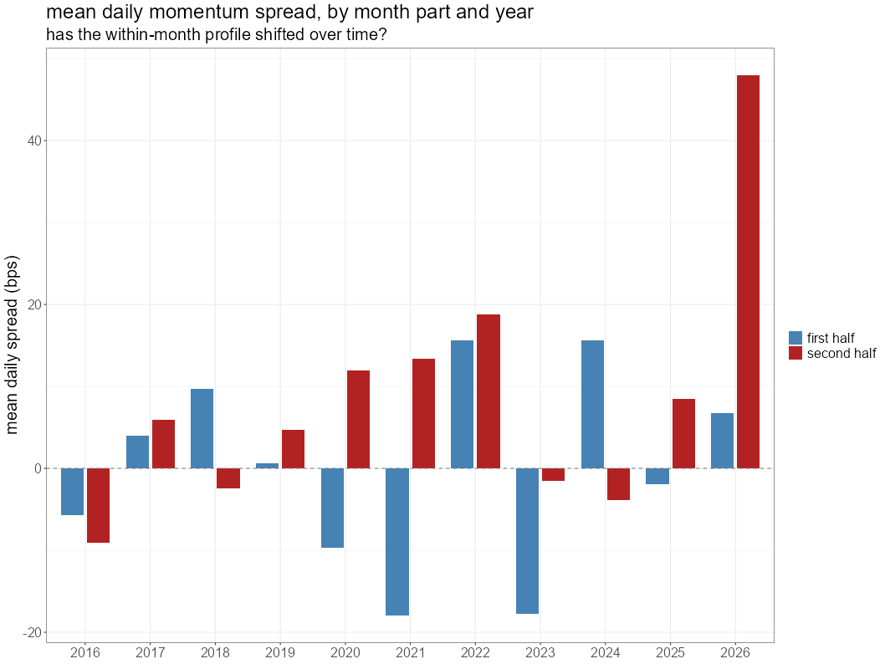

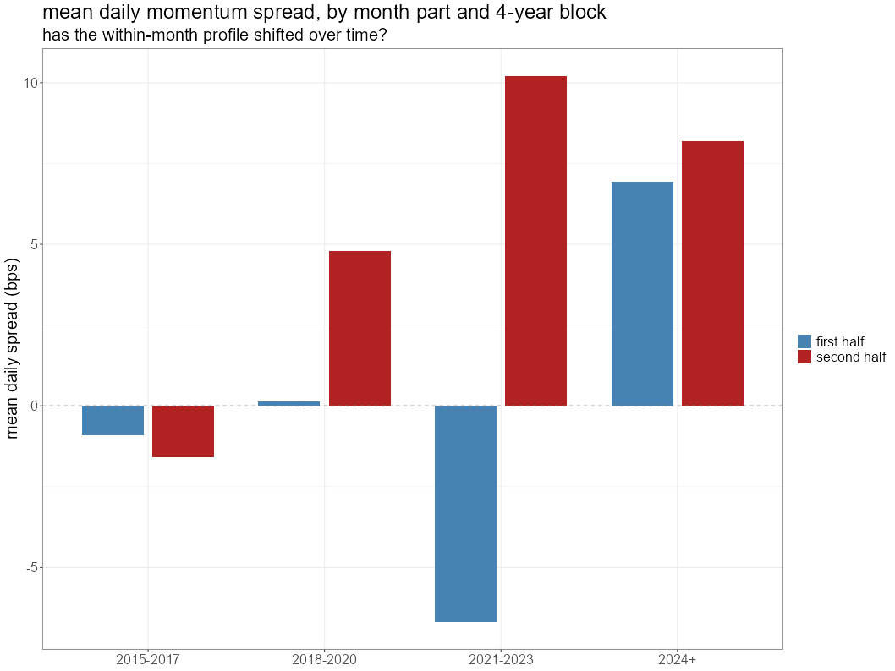

And equity curves across multiple window definitions:

```r
window_curves <- daily_by_tday %>%
  arrange(date) %>%
  mutate(
    ls_pretom_paper  = if_else(t_day <= -4 & t_day >= -9, ls, 0),
    ls_t10_to_end    = if_else(t_day >= -10, ls, 0),
    ls_start_to_t11  = if_else(t_day < -10, ls, 0)
  ) %>%
  mutate(
    cum_always        = cumsum(replace_na(ls, 0)),
    cum_pretom_paper  = cumsum(replace_na(ls_pretom_paper, 0)),
    cum_t10_to_end    = cumsum(replace_na(ls_t10_to_end, 0)),
    cum_start_to_t11  = cumsum(replace_na(ls_start_to_t11, 0))
  )

window_curves %>%
  select(date, cum_always, cum_pretom_paper, cum_t10_to_end, cum_start_to_t11) %>%
  pivot_longer(-date, names_to = "window", values_to = "cum_ret") %>%
  mutate(window = case_when(
    window == "cum_always"       ~ "always on",
    window == "cum_pretom_paper" ~ "paper PreTOM (T-9 to T-4)",
    window == "cum_t10_to_end"   ~ "T-10 to month-end",
    window == "cum_start_to_t11" ~ "month-start to T-11"
  )) %>%
  mutate(window = factor(window, levels = c(
    "always on", "T-10 to month-end", "paper PreTOM (T-9 to T-4)", "month-start to T-11"
  ))) %>%
  ggplot(aes(date, cum_ret, colour = window)) +
  geom_line(linewidth = 0.7) +
  geom_hline(yintercept = 0, linetype = "dashed", colour = "grey50") +
  scale_colour_manual(values = c(
    "always on"                = "grey40",
    "T-10 to month-end"        = "steelblue",
    "paper PreTOM (T-9 to T-4)" = "firebrick",
    "month-start to T-11"      = "coral"
  )) +
  labs(title = "momentum L/S equity curves by within-month window",
       x = NULL, y = "cumulative D10-D1 return", colour = NULL) +
  theme_minimal(base_size = 11) +
  theme(legend.position = "bottom")
```

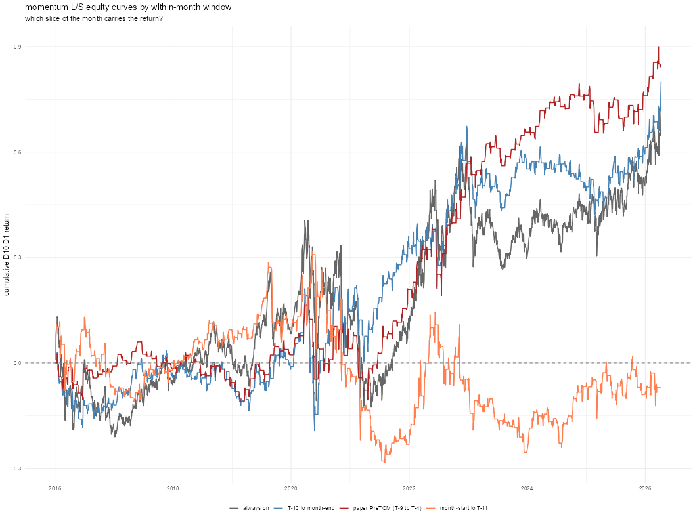

**Key finding:** The day-level data does *not* support a clean 6-day on/off switch at T-9 to T-4 in this universe. T-9 is actually one of the *weakest* days (negative in the pooled data). T-8 is the single strongest day. The yearly facets show no stable day-level pattern — the "strong days" shift around year to year.

A more honest framing: the second half of the month is noisily more positive than the first half. The second half outperforms the first in 8 out of 11 years. Any implementation trying to be surgically in/out on exactly 6 days would be over-fitting a noisy pattern. A more robust approach: tilt the momentum sleeve toward the second half of the month, accept that the timing is approximate, and don't build a strategy that depends on precise boundaries.

---

## Conditioning Momentum on Things That Likely Matter

Before exploring confounds, it's worth understanding *why* we condition at all. When you sort 2000 stocks into momentum deciles, the top decile doesn't just contain "high momentum" stocks — it also contains a non-random mix of sectors, volatility levels, market caps, and betas. If tech happened to trend this year, the top momentum decile is overweight tech, and you can't tell whether the spread is paying for momentum or for sector exposure.

Conditioning means: bucket the universe by a control variable first (quintiles of vol, beta, or sector groups), then within each bucket re-sort by the factor, then compute the D10-D1 spread within each bucket separately. This holds the conditioning variable roughly constant while asking if the factor still predicts returns.

The practical value is threefold:
1. **Confound test:** if the spread collapses inside every bucket, the "factor" was just the conditioning variable
2. **Where it works and where it doesn't:** momentum might pay big in liquid names and not at all in illiquid ones, which is an implementability finding
3. **What to neutralise:** if sector-neutralisation halves the spread, half the "momentum" was sector timing, and you should decide deliberately whether you want that exposure

---

## 7D. Conditioning on Liquidity (Dollar Volume)

**Research question:** Does the momentum premium survive in the liquid end of the universe, or is it a micro-cap artefact? And does the PreTOM asymmetry concentrate in liquid losers, as the dash-for-cash hypothesis predicts?

```r
ft_sz <- ft %>%
  filter(!is.na(mom_12_1), !is.na(fwd_20), !is.na(dolvol), dolvol > 0) %>%
  group_by(date) %>%
  mutate(dv_tercile = ntile(dolvol, 3)) %>%
  ungroup()

sz_spread <- ft_sz %>%
  group_by(dv_tercile, date) %>%
  mutate(decile = ntile(mom_12_1, 10)) %>%
  ungroup() %>%
  filter(decile %in% c(1, 10)) %>%
  group_by(dv_tercile, decile) %>%
  summarise(mean_fwd_20 = mean(fwd_20), .groups = "drop") %>%
  pivot_wider(names_from = decile, values_from = mean_fwd_20, names_prefix = "d") %>%
  mutate(spread_bps = (d10 - d1) * 1e4,
         tercile_label = recode(as.character(dv_tercile),
                                "1" = "low dolvol",
                                "2" = "mid dolvol",
                                "3" = "high dolvol"))
sz_spread
```

```r
sz_spread %>%
  ggplot(aes(tercile_label, spread_bps, fill = tercile_label)) +
  geom_bar(stat = "identity", show.legend = FALSE) +
  labs(title = "mom_12_1: D10 - D1 spread by dollar-volume tercile",
       x = NULL, y = "spread (bps, fwd_20)")
```

PreTOM decomposition across liquidity terciles:

```r
ft_sz_pretom <- ft_sz %>%
  inner_join(trading_dates, by = "date") %>%
  filter(!is.na(fwd_1)) %>%
  bucket_factor("mom_12_1")

tercile_pretom_spread <- ft_sz_pretom %>%
  filter(decile %in% c(1, 10)) %>%
  group_by(dv_tercile, pretom, decile) %>%
  summarise(mean_ret = mean(fwd_1, na.rm = TRUE) * 1e4, .groups = "drop") %>%
  pivot_wider(names_from = decile, values_from = mean_ret, names_prefix = "d") %>%
  mutate(
    spread_bps    = d10 - d1,
    tercile_label = case_when(
      dv_tercile == 1 ~ "low dolvol",
      dv_tercile == 2 ~ "mid dolvol",
      dv_tercile == 3 ~ "high dolvol"
    ),
    window = if_else(pretom, "PreTOM", "non-PreTOM")
  )

tercile_pretom_spread %>%
  select(tercile_label, window, d1, d10, spread_bps) %>%
  arrange(tercile_label, window)

tercile_pretom_spread %>%
  mutate(tercile_label = factor(tercile_label,
    levels = c("low dolvol", "mid dolvol", "high dolvol"))) %>%
  ggplot(aes(tercile_label, spread_bps, fill = window)) +
  geom_col(position = position_dodge(width = 0.8), width = 0.7) +
  geom_hline(yintercept = 0, linetype = "dashed", colour = "grey50") +
  scale_fill_manual(values = c("non-PreTOM" = "steelblue", "PreTOM" = "firebrick")) +
  labs(title = "momentum D10-D1 spread by dolvol tercile: PreTOM vs non-PreTOM",
       subtitle = "does the PreTOM effect concentrate in liquid names?",
       x = NULL, y = "mean daily spread (bps, fwd_1)") +
  theme_minimal(base_size = 12) +
  theme(legend.position = "bottom")

# side decomposition: D1 and D10 separately
ft_sz_pretom %>%
  filter(decile %in% c(1, 10)) %>%
  group_by(dv_tercile, pretom, decile) %>%
  summarise(mean_bps = mean(fwd_1, na.rm = TRUE) * 1e4, .groups = "drop") %>%
  mutate(
    tercile_label = factor(
      case_when(dv_tercile == 1 ~ "low dolvol", dv_tercile == 2 ~ "mid dolvol",
                dv_tercile == 3 ~ "high dolvol"),
      levels = c("low dolvol", "mid dolvol", "high dolvol")),
    decile_label  = if_else(decile == 1, "D1 (losers)", "D10 (winners)"),
    window        = if_else(pretom, "PreTOM", "non-PreTOM")
  ) %>%
  ggplot(aes(window, mean_bps, fill = decile_label)) +
  geom_col(position = position_dodge(width = 0.8), width = 0.7) +
  geom_hline(yintercept = 0, linetype = "dashed", colour = "grey50") +
  facet_wrap(~ tercile_label) +
  scale_fill_manual(values = c("D1 (losers)" = "firebrick", "D10 (winners)" = "steelblue")) +
  labs(title = "D1 and D10 returns by dolvol tercile and PreTOM window",
       x = NULL, y = "mean daily return (bps, fwd_1)") +
  theme_minimal(base_size = 11) +
  theme(legend.position = "bottom")
```

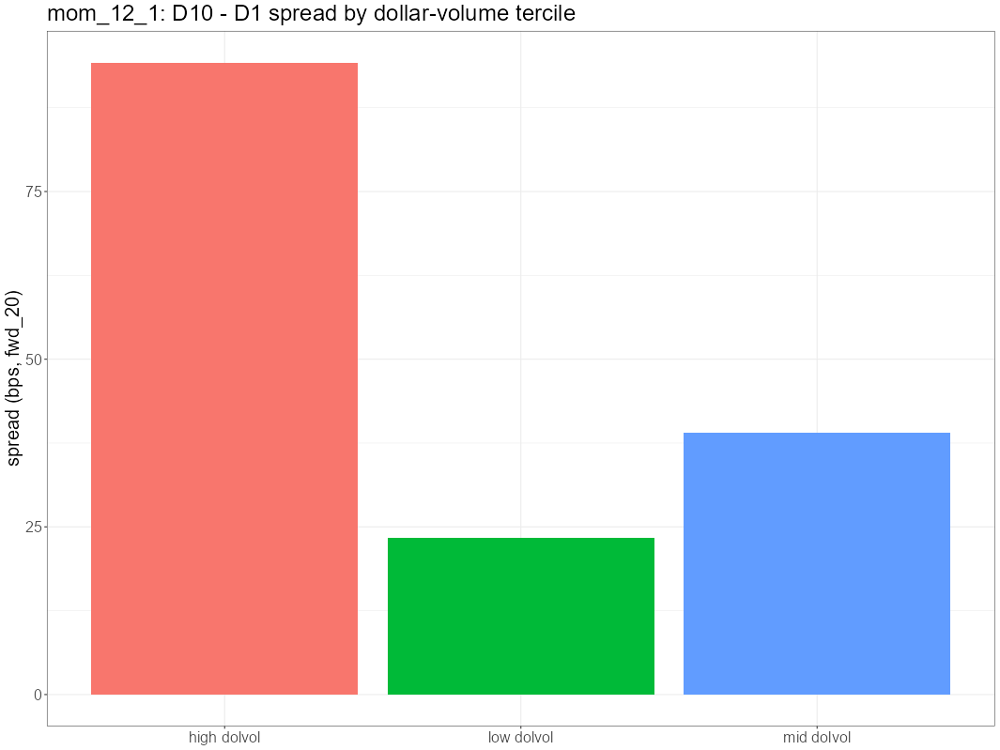

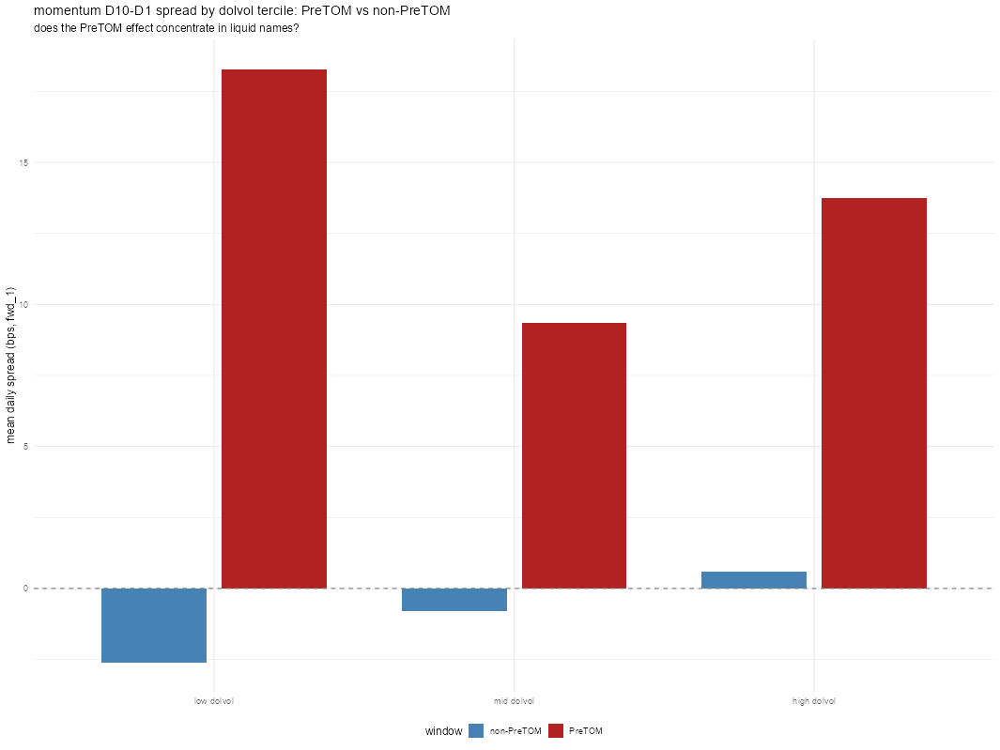

**Surprising finding:** Momentum performs *best* in the most liquid tercile — the opposite of the conventional wisdom that factor premia concentrate in micro-caps. This is consistent with the dash-for-cash hypothesis: institutions sell what they *can* sell (liquid names), not micro-caps that would be difficult to liquidate quickly. When you decompose by D1 vs D10 in the high-liquidity tercile, the PreTOM spread is driven almost entirely by D1 (losers falling sharply). This is a direct empirical confirmation of the proposed mechanism. It also means the edge is concentrated in the *investable* universe, which is rare and highly useful.

---

## 7E. Conditioning on Realized Volatility

**Research question:** Is the momentum premium just a hidden volatility tilt?

```r
features_and_targets <- features_and_targets %>%
  group_by(ticker) %>%
  arrange(date, .by_group = TRUE) %>%
  mutate(
    dlr     = c(NA_real_, diff(log(closeadj))),
    rvol_60 = RcppRoll::roll_sdr(dlr, n = 60, fill = NA_real_) * sqrt(252)
  ) %>%
  ungroup() %>%
  select(-dlr)

ft <- features_and_targets %>%
  filter(IS_INDEX, closeunadj > 5, volume > 0)
```

```r
ft_rv <- ft %>%
  filter(!is.na(mom_12_1), !is.na(fwd_20), !is.na(rvol_60)) %>%
  group_by(date) %>%
  mutate(rvol_q = ntile(rvol_60, 5)) %>%
  ungroup()

rvol_spread <- ft_rv %>%
  group_by(rvol_q, date) %>%
  mutate(decile = ntile(mom_12_1, 10)) %>%
  ungroup() %>%
  filter(decile %in% c(1, 10)) %>%
  group_by(rvol_q, decile) %>%
  summarise(mean_fwd_20 = mean(fwd_20), .groups = "drop") %>%
  pivot_wider(names_from = decile, values_from = mean_fwd_20, names_prefix = "d") %>%
  mutate(spread_bps = (d10 - d1) * 1e4)
rvol_spread
```

```r
rvol_spread %>%
  ggplot(aes(factor(rvol_q), spread_bps, fill = factor(rvol_q))) +
  geom_col(show.legend = FALSE) +
  labs(title = "mom_12_1: D10 - D1 spread by realised-vol quintile",
       subtitle = "Q1 = low rvol, Q5 = high rvol",
       x = "realised-vol quintile", y = "spread (bps, fwd_20)")
```

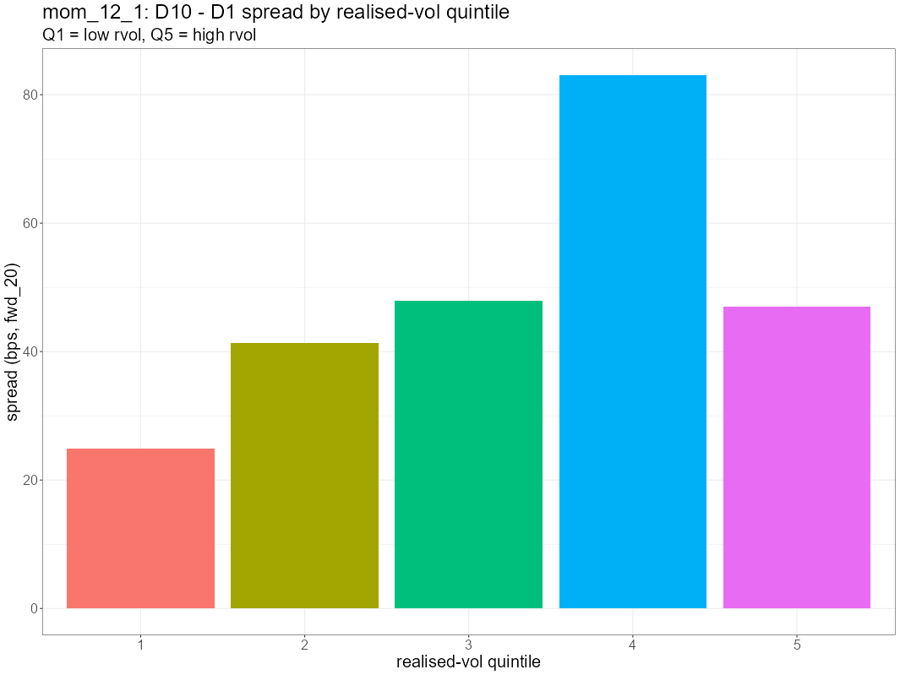

**Findings:** The spread is positive across all volatility quintiles — momentum is not a hidden vol trade. If it were, the spread would collapse or disappear in low-vol quintiles. The spread peaks in Q4 and falls back in Q5 (extreme vol). The Q5 softening is consistent with the "crash risk" story — the highest-vol stocks are the ones most prone to momentum crashes, where winners reverse sharply in a drawdown. The factor is fragile in extreme volatility, but this is a nuance, not a refutation.

---

## 7F. Conditioning on Market Beta

**Research question:** Is momentum just beta in disguise?

High-beta stocks drift up in uptrending markets, mechanically populating the winner decile. If you then sort by 12-month return, you might end up long high-beta, short low-beta without any stock-selection content. If the spread collapses once we slice by beta, that's what's happening.

```r
mkt_ret <- features_and_targets %>%
  filter(IS_INDEX, closeunadj > 5, volume > 0) %>%
  group_by(ticker) %>%
  arrange(date, .by_group = TRUE) %>%
  mutate(dlr = c(NA_real_, diff(log(closeadj)))) %>%
  ungroup() %>%
  filter(!is.na(dlr)) %>%
  group_by(date) %>%
  summarise(mkt_dlr = mean(dlr), .groups = "drop")

features_and_targets <- features_and_targets %>%
  group_by(ticker) %>%
  arrange(date, .by_group = TRUE) %>%
  mutate(dlr = c(NA_real_, diff(log(closeadj)))) %>%
  ungroup() %>%
  left_join(mkt_ret, by = "date")

# rolling 60d beta via RcppRoll primitives (vectorised OLS slope formula)
# beta = (n * sum(xy) - sum(x) * sum(y)) / (n * sum(x^2) - sum(x)^2)
w <- 60L
features_and_targets <- features_and_targets %>%
  group_by(ticker) %>%
  arrange(date, .by_group = TRUE) %>%
  mutate(
    sum_xy  = RcppRoll::roll_sumr(dlr * mkt_dlr, n = w, fill = NA_real_),
    sum_x   = RcppRoll::roll_sumr(mkt_dlr,       n = w, fill = NA_real_),
    sum_y   = RcppRoll::roll_sumr(dlr,            n = w, fill = NA_real_),
    sum_xx  = RcppRoll::roll_sumr(mkt_dlr^2,      n = w, fill = NA_real_),
    denom   = w * sum_xx - sum_x^2,
    beta_60 = if_else(abs(denom) > 1e-12, (w * sum_xy - sum_x * sum_y) / denom, NA_real_)
  ) %>%
  ungroup() %>%
  select(-dlr, -mkt_dlr, -sum_xy, -sum_x, -sum_y, -sum_xx, -denom)

ft <- features_and_targets %>%
  filter(IS_INDEX, closeunadj > 5, volume > 0)
```

Note the beta formula is computed fully vectorised using `RcppRoll` primitives rather than a per-ticker loop. The OLS slope formula is `β = (n·Σxy - Σx·Σy) / (n·Σx² - (Σx)²)` where x is the market return and y is the stock return. All five rolling sums are computed simultaneously.

```r
ft_b <- ft %>%
  filter(!is.na(mom_12_1), !is.na(fwd_20), !is.na(beta_60)) %>%
  group_by(date) %>%
  mutate(beta_q = ntile(beta_60, 5)) %>%
  ungroup()

beta_spread <- ft_b %>%
  group_by(beta_q, date) %>%
  mutate(decile = ntile(mom_12_1, 10)) %>%
  ungroup() %>%
  filter(decile %in% c(1, 10)) %>%
  group_by(beta_q, decile) %>%
  summarise(mean_fwd_20 = mean(fwd_20), .groups = "drop") %>%
  pivot_wider(names_from = decile, values_from = mean_fwd_20, names_prefix = "d") %>%
  mutate(spread_bps = (d10 - d1) * 1e4)

beta_spread
```

```r
beta_spread %>%
  ggplot(aes(factor(beta_q), spread_bps, fill = factor(beta_q))) +
  geom_col(show.legend = FALSE) +
  labs(title = "mom_12_1: D10 - D1 spread by market-beta quintile",
       subtitle = "Q1 = low beta, Q5 = high beta. beta from 60d rolling ols on equal-weight market",
       x = "beta quintile", y = "spread (bps, fwd_20)")
```

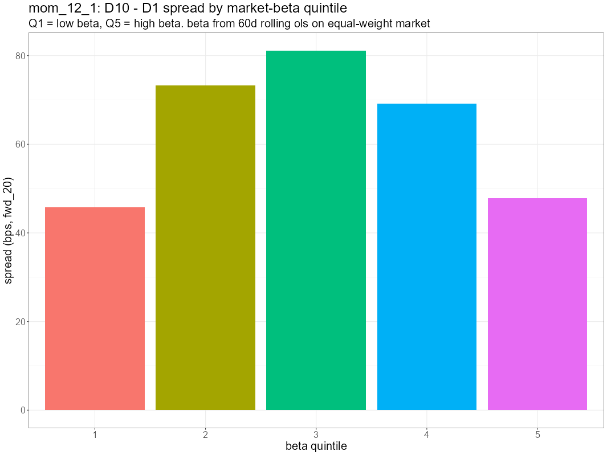

**Findings:** The D10-D1 spread survives in *every* beta bucket — momentum is not just beta in disguise. The shape is an inverted-U: momentum is weakest in the very-low-beta and very-high-beta names, and peaks in the mid-beta range. The mechanism for this inverted-U isn't fully explained, but it's consistent with the factor working through something other than market exposure.

---

## 7H. Sector Neutralisation

**Research question:** How much of the momentum premium is stock selection versus sector rotation?

If biotechs have been ripping for six months, they'll all land in the top decile of a 12-1 sort regardless of any stock-specific information. The D10-D1 spread would then be paying for "the sector that happened to trend", not a stock-level edge.

### Step 1: Raw spread by sector

```r
ft_sec <- ft %>%
  filter(!is.na(mom_12_1), !is.na(fwd_20)) %>%
  inner_join(sectors %>% select(ticker, sector), by = "ticker")

sector_spread <- ft_sec %>%
  group_by(sector, date) %>%
  mutate(decile = ntile(mom_12_1, 10)) %>%
  ungroup() %>%
  filter(decile %in% c(1, 10)) %>%
  group_by(sector, decile) %>%
  summarise(mean_fwd_20 = mean(fwd_20), .groups = "drop") %>%
  pivot_wider(names_from = decile, values_from = mean_fwd_20, names_prefix = "d") %>%
  mutate(spread_bps = (d10 - d1) * 1e4) %>%
  arrange(desc(spread_bps))

sector_spread
```

```r
sector_spread %>%
  mutate(sector = forcats::fct_reorder(sector, spread_bps)) %>%
  ggplot(aes(sector, spread_bps, fill = sector)) +
  geom_col(show.legend = FALSE) +
  coord_flip() +
  labs(title = "mom_12_1: raw D10 - D1 spread by sector",
       x = NULL, y = "spread (bps, fwd_20)")
```

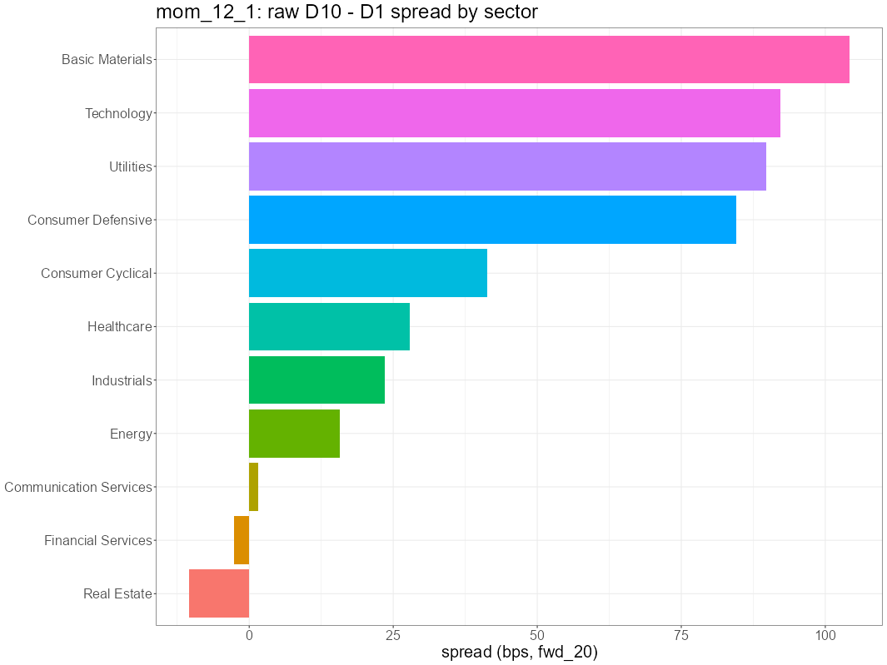

Momentum does *not* show up uniformly across sectors. Two sectors are inverted: Real Estate and Financial Services. The REIT inversion is well-documented — REITs mean-revert rather than trend because NAV anchoring and yield-chasing flows pull prices back toward book value.

### Step 2: Sector-neutralised signal

```r
ft_sn <- ft_sec %>%
  group_by(date, sector) %>%
  mutate(mom_sn = mom_12_1 - mean(mom_12_1, na.rm = TRUE)) %>%
  ungroup() %>%
  filter(!is.na(mom_sn))

sn_spread <- ft_sn %>%
  group_by(date) %>%
  mutate(decile = ntile(mom_sn, 10)) %>%
  ungroup() %>%
  filter(decile %in% c(1, 10)) %>%
  group_by(decile) %>%
  summarise(mean_fwd_20 = mean(fwd_20), .groups = "drop") %>%
  pivot_wider(names_from = decile, values_from = mean_fwd_20, names_prefix = "d") %>%
  mutate(spread_bps = (d10 - d1) * 1e4)

raw_spread <- ft_sec %>%
  group_by(date) %>%
  mutate(decile = ntile(mom_12_1, 10)) %>%
  ungroup() %>%
  filter(decile %in% c(1, 10)) %>%
  group_by(decile) %>%
  summarise(mean_fwd_20 = mean(fwd_20), .groups = "drop") %>%
  pivot_wider(names_from = decile, values_from = mean_fwd_20, names_prefix = "d") %>%
  mutate(spread_bps = (d10 - d1) * 1e4)

compare_spread <- tibble::tibble(
  variant    = c("raw mom_12_1", "sector-neutralised"),
  spread_bps = c(raw_spread$spread_bps, sn_spread$spread_bps)
)
compare_spread
```

```r
compare_spread %>%
  ggplot(aes(variant, spread_bps, fill = variant)) +
  geom_col(show.legend = FALSE) +
  labs(title = "mom_12_1: raw vs sector-neutralised D10 - D1 spread",
       x = NULL, y = "spread (bps, fwd_20)")
```

Year-by-year breakdown of the sector component:

```r
annual_raw <- ft_sec %>%
  group_by(date) %>%
  mutate(decile = ntile(mom_12_1, 10)) %>%
  ungroup() %>%
  filter(decile %in% c(1, 10), !is.na(fwd_20)) %>%
  mutate(year = year(date)) %>%
  group_by(year, decile) %>%
  summarise(mean_fwd_20 = mean(fwd_20), .groups = "drop") %>%
  pivot_wider(names_from = decile, values_from = mean_fwd_20, names_prefix = "d") %>%
  mutate(spread_bps = (d10 - d1) * 1e4, variant = "raw mom_12_1")

annual_sn <- ft_sn %>%
  group_by(date) %>%
  mutate(decile = ntile(mom_sn, 10)) %>%
  ungroup() %>%
  filter(decile %in% c(1, 10), !is.na(fwd_20)) %>%
  mutate(year = year(date)) %>%
  group_by(year, decile) %>%
  summarise(mean_fwd_20 = mean(fwd_20), .groups = "drop") %>%
  pivot_wider(names_from = decile, values_from = mean_fwd_20, names_prefix = "d") %>%
  mutate(spread_bps = (d10 - d1) * 1e4, variant = "sector-neutralised")

bind_rows(annual_raw, annual_sn) %>%
  ggplot(aes(factor(year), spread_bps, fill = variant)) +
  geom_col(position = position_dodge(width = 0.8), width = 0.7) +
  geom_hline(yintercept = 0, linetype = "dashed", colour = "grey50") +
  scale_fill_manual(values = c("raw mom_12_1" = "steelblue", "sector-neutralised" = "firebrick")) +
  labs(title = "raw vs sector-neutralised momentum spread, by year",
       subtitle = "is the sector component stable or lumpy?",
       x = NULL, y = "D10-D1 spread (bps, fwd_20)") +
  theme_minimal(base_size = 11) +
  theme(legend.position = "bottom")
```

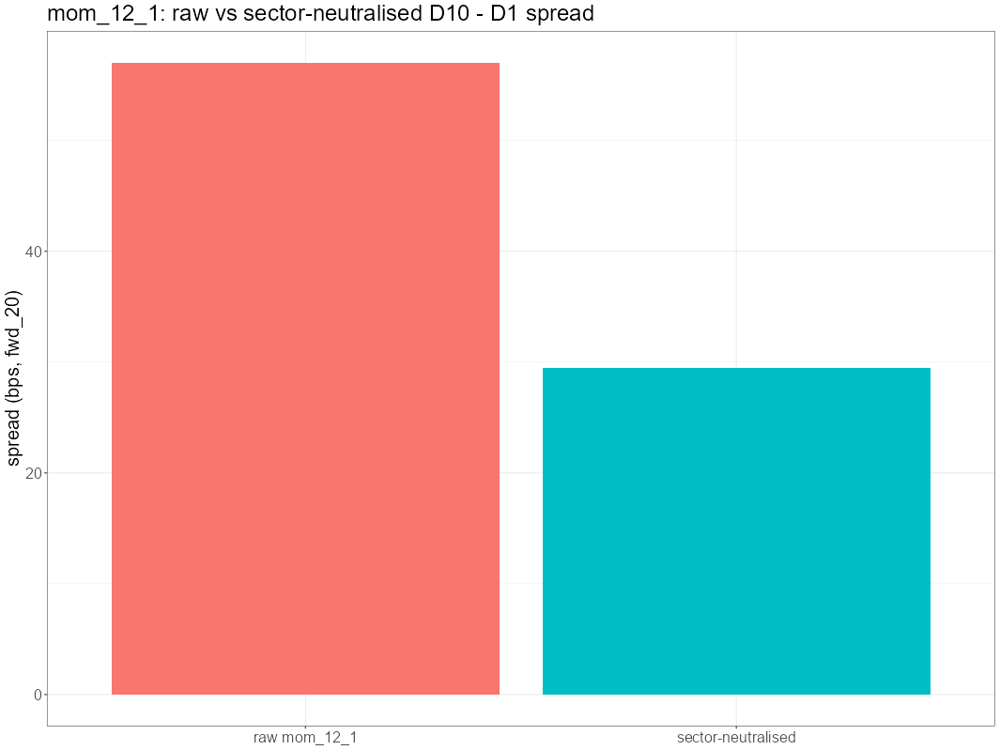

**Findings:** Sector-neutralised momentum is about half the raw spread over the full sample. A material chunk of what we've been calling "momentum" is sector rotation, not within-sector stock picking.

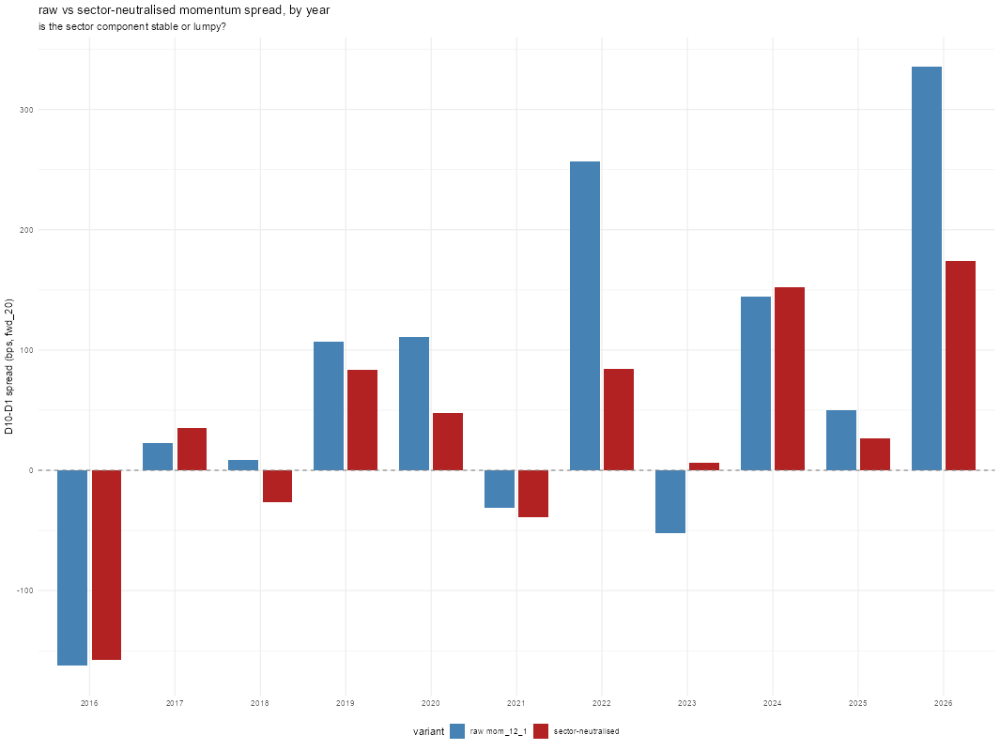

The year-by-year breakdown reveals a subtler story: in most years, the two bars are similar in magnitude — momentum in those years was mostly within-sector stock selection. The large gaps appear in 2020, 2022, and 2026 — years where one sector dramatically outperformed or underperformed (COVID crash/recovery, rate shock). In those years, the raw spread is dramatically larger than the sector-neutral spread.

**Practical implication:** The sector-neutral signal provides a stable, reliable core return every year. The "extra" raw spread arrives in massive, lumpy bursts during years of high sector dispersion. If you're building a momentum sleeve to combine with other factors, the sector-neutral version is the right base — otherwise you'll accidentally stack sector bets on top of other sector exposures in your portfolio.

---

## 9. Conclusions: What We Learned

In order of strategic relevance:

**1. The PreTOM window is real.** The PreTOM effect replicated in this data, with more asymmetry than expected. The proposed mechanism (month-end dash for cash, institutions dumping losers) is consistent with the loser-driven asymmetry in the liquid tercile, but the T-9 to T-4 window boundaries are an approximation — our data suggests T-8 to T-4 is a better fit, and the effect is diffuse rather than sharp. Treat the window as a rough guide, not gospel. This single finding rewrites how to build a momentum sleeve in a multi-factor portfolio.

**2. The premium lives in liquid names, not just micro-caps.** This is unusual relative to factor folklore ("everything works better in small caps"). It's consistent with the dash-for-cash story — institutions sell what they can sell, which means liquid stocks, not micro-caps. This also means the factor is potentially tradeable at meaningful size.

**3. The lookback sweep shows a sign flip at ~21 days; ~126-day momentum may be competitive with 252-day.** Short lookbacks reverse (mean reversion), and the crossover to momentum is somewhere between 21 and 63 days. The 12-month spec isn't necessarily optimal.

**4. Sector-neutralisation roughly halves the full-sample spread, but the sector component is regime-dependent.** In normal years, sector rotation adds a little. In years with strong sector dispersion (2020, 2022), the sector component dominates. Whether to include the sector-rotation component is a deliberate choice, not an oversight.

**5. Vol and beta conditioners are benign.** The factor survives across both, with some interesting nuance (weaker in extreme vol, inverted-U across beta). Neither breaks the factor or contradicts the mechanism story.

---

## 10. What's Next

In rough priority order:

- **Trade the PreTOM window standalone.** Build rules around a calendar-aware momentum book. Test adjacent windows (T-10 to T-5, T-8 to T-3) to see if the effect is sharply defined or diffuse. Run it through `rsims`.
- **Cross-sectional dispersion.** How does momentum look conditioned on dispersion? Is it sticky? What's the relationship with sector-neutral momentum?
- **Design a momentum factor sleeve.** With consideration for liquidity tercile, cadence (monthly, not daily), and PreTOM phasing.
- **Deeper lookback analysis.** Only 252-day was explored in detail; 126-day looked competitive. Needs more systematic work.
- **Sector-specific filters.** Given that Real Estate and Financials invert, consider excluding or down-weighting them in the momentum sleeve.
- **Fundamentals-persistence test.** Bring in earnings-revision data, double-sort momentum by earnings revision direction. If the spread concentrates in stocks with positive fundamental news and collapses in stocks that moved on no news, the fundamentals-persistence mechanism has legs. If the spread is uniform regardless, momentum is flow, not fundamentals.
- **PreTOM × sector interaction.** Are the PreTOM windfall days concentrated in the same sectors that carry the raw-momentum spread (Basic Materials, Technology)?
